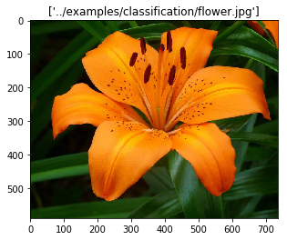

# Part 3: Putting it all together: Compile, Quantize and Deploy

In this Part of the lab, we will review what we learned in Parts 1 and 2, and deploy models to be accelerated on the FPGA. We will look at each step of the deployment process. 

Once you have the outputs of the compiler and quantizer, you will use the xfDNN deployment APIs to:
1. Open a handle for FPGA communication
2. Load weights, biases, and quantization parameters to the FPGA DDR
3. Allocate storage for FPGA inputs (such as images to process)
4. Allocate storage for FPGA outputs (the activation of the final layer run on the FPGA)
5. Execute the network
6. Run fully connected layers on the CPU
7. Run Softmax on CPU
8. Print the result (or send the result for further processing)
9. When you are done, close the handle to the FPGA

First, we will look at compiling, quantizing and deploying a Inception v1 image classification example. After completing the example, we will look at deploying a customer model, using the same steps. 

### 1. Import required packages, check environment


```python
import os,sys,cv2
from __future__ import print_function

from matplotlib import pyplot as plt
%matplotlib inline

# Bring in Xilinx ML-Suite Compiler, Quantizer, PyXDNN
from xfdnn.tools.compile.bin.xfdnn_compiler_caffe import CaffeFrontend as xfdnnCompiler
from xfdnn.tools.quantize.quantize import CaffeFrontend as xfdnnQuantizer
import xfdnn.rt.xdnn as pyxfdnn
import xfdnn.rt.xdnn_io as pyxfdnn_io

import warnings
warnings.simplefilter("ignore", UserWarning)

print("Current working directory: %s" % os.getcwd())
print("Running on host: %s" % os.uname()[1])
print("Running w/ LD_LIBRARY_PATH: %s" %  os.environ["LD_LIBRARY_PATH"])
print("Running w/ XILINX_OPENCL: %s" %  os.environ["XILINX_OPENCL"])
print("Running w/ XCLBIN_PATH: %s" %  os.environ["XCLBIN_PATH"])
print("Running w/ PYTHONPATH: %s" %  os.environ["PYTHONPATH"])
print("Running w/ SDACCEL_INI_PATH: %s" %  os.environ["SDACCEL_INI_PATH"])

!whoami
# Make sure there is no error in this cell
# The xfDNN runtime depends upon the above environment variables
```

    Current working directory: /home/centos/MLsuite/notebooks
    Running on host: ip-172-31-27-215.ec2.internal
    Running w/ LD_LIBRARY_PATH: /home/centos/MLsuite/overlaybins/aws/runtime/lib/x86_64/:/home/centos/MLsuite/xfdnn/rt/xdnn_cpp/build/lib:/home/centos/MLsuite/xfdnn/rt/lib:/home/centos/MLsuite/ext/boost/lib:/root
    Running w/ XILINX_OPENCL: /home/centos/MLsuite/overlaybins/aws
    Running w/ XCLBIN_PATH: /home/centos/MLsuite/overlaybins/aws
    Running w/ PYTHONPATH: /home/centos/MLsuite:/home/centos/MLsuite/xfdnn/rt:/home/centos/MLsuite/xfdnn/tools/emu
    Running w/ SDACCEL_INI_PATH: /home/centos/MLsuite/overlaybins
    root


### 2. Use a config dictionary to pass parameters

Similar to Parts 1 and 2, we will setup and use a config dictionary to simplify handing the arguments. In this cell, we will also perform some basic error checking. For this first example, we will attempt to classify a picture of a dog. 


```python
config = {}

# Quick check to see if we are running on AWS, if not assume 1525 box
if os.path.exists("/sys/hypervisor/uuid"):
    with open("/sys/hypervisor/uuid") as fp:
        contents = fp.read()
        if "ec2" in contents:
            print("Runnning on Amazon AWS EC2")
            config["device"] = "aws"
else:
    print("Runnning on VCU1525")
    config["device"] = "1525"


config["images"] = ["../examples/classification/flower.jpg"] # Image of interest (Must provide as a list)

img = cv2.imread(config["images"][0])
img = cv2.cvtColor(img, cv2.COLOR_BGR2RGB)
plt.imshow(img)
plt.title(config["images"])
plt.show()
```

    Runnning on Amazon AWS EC2





### 3. Compile The Model

As in Part 1, we will use the xfDNN Compiler to compile the Inception v1 network defined in Caffe. Please refer to the parameter descriptions in Part 1 for guidance on these parameters. 


```python
# Compiler Arguments

config["prototxt"] = "../models/caffe/flowers102/fp32/bvlc_googlenet_without_lrn_deploy.prototxt" 
config["caffemodel"] = "../models/caffe/flowers102/fp32/bvlc_googlenet_without_lrn.caffemodel"
config["outmodel"] = "work/optimized_model" # String for naming optimized prototxt, caffemodel
config["fpgacommands"] = "work/fpga.cmds" # Compiler will generate FPGA instructions
config["memory"] = 5 # Available on-chip SRAM
config["dsp"] = 56 # Width of Systolic Array
config["ddr"] = 256 # Available off-chip DRAM

compiler = xfdnnCompiler(
    networkfile=config["prototxt"],       # Prototxt filename: input file
    weights=config["caffemodel"],         # Floating Point Weights: input file
    anew=config["outmodel"],              # String for intermediate prototxt/caffemodel
    generatefile=config["fpgacommands"],  # Script filename: output file
    memory=config["memory"],              # Available on chip SRAM within xclbin
    dsp=config["dsp"],                    # Rows in DSP systolic array within xclbin 
    ddr=config["ddr"]                     # Memory to allocate in FPGA DRAM for activation spill
)

# Invoke compiler
try:
    compiler.compile()

    # The compiler extracts the floating point weights from the .caffemodel. 
    # This weights dir will be stored in the work dir with the appendex '_data'. 
    # The compiler will name it after the caffemodel, and append _data
    config["datadir"] = "work/" + config["caffemodel"].split("/")[-1]+"_data"
        
    if os.path.exists(config["datadir"]) and os.path.exists(config["fpgacommands"]+".json"):
        print("Compiler successfully generated JSON and the data directory: %s" % config["datadir"])
    else:
        print("Compiler failed to generate the JSON or data directory: %s" % config["datadir"])
        raise
        
    print("**********\nCompilation Successful!\n")
    
    import json
    data = json.loads(open(config["fpgacommands"]+".json").read())
    print("Network Operations Count: %d"%data['ops'])
    print("DDR Transfers (bytes): %d"%data['moveops']) 
    
except Exception as e:
    print("Failed to complete compilation:",e)

```

    Network: ../models/caffe/flowers102/fp32/bvlc_googlenet_without_lrn_deploy.prototxt
    GenerateCode: work/fpga.cmds
    Weights: ../models/caffe/flowers102/fp32/bvlc_googlenet_without_lrn.caffemodel
    PngFile: None
    ConcatStrategy: None
    Strategy: all
    ScheduleFile: None
    DSP: 56
    Verbose: False
    FromTF: False
    Memory: 5
    DDR: 256
    Phase: TEST
    RankDir: BT
    
    **************************************************
    * BUILDING DATA FLOW GRAPH
    **************************************************
    
    **************************************************
    * BUILDING NETWORK SCHEDULE
    **************************************************
    Network Schedule ['data', 'conv1/7x7_s2', 'conv1/relu_7x7', 'pool1/3x3_s2', 'conv2/3x3_reduce', 'conv2/relu_3x3_reduce', 'conv2/3x3', 'conv2/relu_3x3', 'pool2/3x3_s2', 'inception_3a/1x1', 'inception_3a/relu_1x1', 'inception_3a/3x3_reduce', 'inception_3a/relu_3x3_reduce', 'inception_3a/3x3', 'inception_3a/relu_3x3', 'inception_3a/5x5_reduce', 'inception_3a/relu_5x5_reduce', 'inception_3a/5x5', 'inception_3a/relu_5x5', 'inception_3a/pool', 'inception_3a/pool_proj', 'inception_3a/relu_pool_proj', 'inception_3a/output', 'inception_3b/1x1', 'inception_3b/relu_1x1', 'inception_3b/3x3_reduce', 'inception_3b/relu_3x3_reduce', 'inception_3b/3x3', 'inception_3b/relu_3x3', 'inception_3b/5x5_reduce', 'inception_3b/relu_5x5_reduce', 'inception_3b/5x5', 'inception_3b/relu_5x5', 'inception_3b/pool', 'inception_3b/pool_proj', 'inception_3b/relu_pool_proj', 'inception_3b/output', 'pool3/3x3_s2', 'inception_4a/1x1', 'inception_4a/relu_1x1', 'inception_4a/3x3_reduce', 'inception_4a/relu_3x3_reduce', 'inception_4a/3x3', 'inception_4a/relu_3x3', 'inception_4a/5x5_reduce', 'inception_4a/relu_5x5_reduce', 'inception_4a/5x5', 'inception_4a/relu_5x5', 'inception_4a/pool', 'inception_4a/pool_proj', 'inception_4a/relu_pool_proj', 'inception_4a/output', 'inception_4b/1x1', 'inception_4b/relu_1x1', 'inception_4b/3x3_reduce', 'inception_4b/relu_3x3_reduce', 'inception_4b/3x3', 'inception_4b/relu_3x3', 'inception_4b/5x5_reduce', 'inception_4b/relu_5x5_reduce', 'inception_4b/5x5', 'inception_4b/relu_5x5', 'inception_4b/pool', 'inception_4b/pool_proj', 'inception_4b/relu_pool_proj', 'inception_4b/output', 'inception_4c/1x1', 'inception_4c/relu_1x1', 'inception_4c/3x3_reduce', 'inception_4c/relu_3x3_reduce', 'inception_4c/3x3', 'inception_4c/relu_3x3', 'inception_4c/5x5_reduce', 'inception_4c/relu_5x5_reduce', 'inception_4c/5x5', 'inception_4c/relu_5x5', 'inception_4c/pool', 'inception_4c/pool_proj', 'inception_4c/relu_pool_proj', 'inception_4c/output', 'inception_4d/1x1', 'inception_4d/relu_1x1', 'inception_4d/3x3_reduce', 'inception_4d/relu_3x3_reduce', 'inception_4d/3x3', 'inception_4d/relu_3x3', 'inception_4d/5x5_reduce', 'inception_4d/relu_5x5_reduce', 'inception_4d/5x5', 'inception_4d/relu_5x5', 'inception_4d/pool', 'inception_4d/pool_proj', 'inception_4d/relu_pool_proj', 'inception_4d/output', 'inception_4e/1x1', 'inception_4e/relu_1x1', 'inception_4e/3x3_reduce', 'inception_4e/relu_3x3_reduce', 'inception_4e/3x3', 'inception_4e/relu_3x3', 'inception_4e/5x5_reduce', 'inception_4e/relu_5x5_reduce', 'inception_4e/5x5', 'inception_4e/relu_5x5', 'inception_4e/pool', 'inception_4e/pool_proj', 'inception_4e/relu_pool_proj', 'inception_4e/output', 'pool4/3x3_s2', 'inception_5a/1x1', 'inception_5a/relu_1x1', 'inception_5a/3x3_reduce', 'inception_5a/relu_3x3_reduce', 'inception_5a/3x3', 'inception_5a/relu_3x3', 'inception_5a/5x5_reduce', 'inception_5a/relu_5x5_reduce', 'inception_5a/5x5', 'inception_5a/relu_5x5', 'inception_5a/pool', 'inception_5a/pool_proj', 'inception_5a/relu_pool_proj', 'inception_5a/output', 'inception_5b/1x1', 'inception_5b/relu_1x1', 'inception_5b/3x3_reduce', 'inception_5b/relu_3x3_reduce', 'inception_5b/3x3', 'inception_5b/relu_3x3', 'inception_5b/5x5_reduce', 'inception_5b/relu_5x5_reduce', 'inception_5b/5x5', 'inception_5b/relu_5x5', 'inception_5b/pool', 'inception_5b/pool_proj', 'inception_5b/relu_pool_proj', 'inception_5b/output', 'pool5/7x7_s1', 'pool5/drop_7x7_s1', 'loss3/classifier_102', 'prob']
    
    **************************************************
    * COMPUTING MEMORY REQUIREMENTS
    **************************************************
    Minimum Memory __________
    33 ['inception_3b/pool'] size:3325952.0 remap:[] data movement:[]
    33	inception_3a/output_blob M[0,917504] Z=917504 F=[23, 25, 29, 33] B=[22] E=[] S=['replace_layer'] ['concat'] L=-1
    33	inception_3b/pool_blob M[0,917504] Z=917504 F=[34] B=[33] E=[] S=['layer'] [] L=-1
    33	inception_3b/5x5_blob M[0,344064] Z=344064 F=[32, 36] B=[31, 32] E=[] S=['layer'] ['concat'] L=-1
    33	inception_3b/3x3_blob M[0,688128] Z=688128 F=[28, 36] B=[27, 28] E=[] S=['layer'] ['concat'] L=-1
    33	inception_3b/1x1_blob M[0,458752] Z=458752 F=[24, 36] B=[23, 24] E=[] S=['layer'] ['concat'] L=-1
    
    **************************************************
    * ALLOCATING DYNAMIC MEMORY SCHEDULE
    **************************************************
    Allocating Memory
    Trying strategy bysize
    
    **************************************************
    * GENERATING OUTPUT REPORTS
    **************************************************
    Minimum Memory 105 ['inception_4e/pool_proj'] 4300800.0
    inception_4e/pool_blob M[3354624,4300800] Z=946176 F=[105] B=[104] E=[1] S=['layer'] [] L=0
    inception_4e/1x1_blob M[1863680,2322432] Z=458752 F=[95, 107] B=[94, 95] E=[-1] S=['layer'] ['concat'] L=0
    inception_4e/3x3_blob M[2322432,2895872] Z=573440 F=[99, 107] B=[98, 99] E=[-1] S=['layer'] ['concat'] L=0
    inception_4e/5x5_blob M[2895872,3125248] Z=229376 F=[103, 107] B=[102, 103] E=[-1] S=['layer'] ['concat'] L=0
    inception_4e/pool_proj_blob M[3125248,3354624] Z=229376 F=[106, 107] B=[105, 106] E=[-1] S=['layer'] ['concat'] L=0
    
    **************************************************
    * GENERATING OUTPUT FILES
    **************************************************
    XDNN Command file: work/fpga.cmds
    XDNN JSON Report file: work/fpga.cmds.json
    OUTPUT REPORT:
    Unsupported Layers: 3
    0) loss3/classifier_102
    	Attributes: ('## 140 XNInner loss3/classifier_102 16 26 2 0x0 1 1024 0x20000 102 102', u'loss3/classifier_102: type=InnerProduct, sizes=None, shapes=[[102, 1024], [102]], sched 139 Kernel None Strides None Padding None  NO VALID CODE  ')
    1) data
    	Attributes: ("# LAYER data [u'Input'] ['layer']", u'data: type=Input, sizes=None, shapes=None, sched 0 Kernel None Strides None Padding None  NO VALID CODE  ')
    2) prob
    	Attributes: ("# LAYER prob [u'Softmax'] ['layer']", u'prob: type=Softmax, sizes=None, shapes=None, sched 140 Kernel None Strides None Padding None  NO VALID CODE  ')
    Compiling weights from: ../models/caffe/flowers102/fp32/bvlc_googlenet_without_lrn.caffemodel
    Writing weights to directory work/bvlc_googlenet_without_lrn.caffemodel_data
    SUCCESS
    
    *************************************************
    * GENERATING new PROTO and new caffemodel weights  
    ***************************************************
    conv1/7x7_s2 0: (64, 3, 7, 7) (64, 3, 7, 7)
    conv2/3x3_reduce 0: (64, 64, 1, 1) (64, 64, 1, 1)
    conv2/3x3 0: (192, 64, 3, 3) (192, 64, 3, 3)
    inception_3a/1x1 0: (64, 192, 1, 1) (64, 192, 1, 1)
    inception_3a/3x3_reduce 0: (96, 192, 1, 1) (96, 192, 1, 1)
    inception_3a/3x3 0: (128, 96, 3, 3) (128, 96, 3, 3)
    inception_3a/5x5_reduce 0: (16, 192, 1, 1) (16, 192, 1, 1)
    inception_3a/5x5 0: (32, 16, 5, 5) (32, 16, 5, 5)
    inception_3a/pool_proj 0: (32, 192, 1, 1) (32, 192, 1, 1)
    inception_3b/1x1 0: (128, 256, 1, 1) (128, 256, 1, 1)
    inception_3b/3x3_reduce 0: (128, 256, 1, 1) (128, 256, 1, 1)
    inception_3b/3x3 0: (192, 128, 3, 3) (192, 128, 3, 3)
    inception_3b/5x5_reduce 0: (32, 256, 1, 1) (32, 256, 1, 1)
    inception_3b/5x5 0: (96, 32, 5, 5) (96, 32, 5, 5)
    inception_3b/pool_proj 0: (64, 256, 1, 1) (64, 256, 1, 1)
    inception_4a/1x1 0: (192, 480, 1, 1) (192, 480, 1, 1)
    inception_4a/3x3_reduce 0: (96, 480, 1, 1) (96, 480, 1, 1)
    inception_4a/3x3 0: (208, 96, 3, 3) (208, 96, 3, 3)
    inception_4a/5x5_reduce 0: (16, 480, 1, 1) (16, 480, 1, 1)
    inception_4a/5x5 0: (48, 16, 5, 5) (48, 16, 5, 5)
    inception_4a/pool_proj 0: (64, 480, 1, 1) (64, 480, 1, 1)
    inception_4b/1x1 0: (160, 512, 1, 1) (160, 512, 1, 1)
    inception_4b/3x3_reduce 0: (112, 512, 1, 1) (112, 512, 1, 1)
    inception_4b/3x3 0: (224, 112, 3, 3) (224, 112, 3, 3)
    inception_4b/5x5_reduce 0: (24, 512, 1, 1) (24, 512, 1, 1)
    inception_4b/5x5 0: (64, 24, 5, 5) (64, 24, 5, 5)
    inception_4b/pool_proj 0: (64, 512, 1, 1) (64, 512, 1, 1)
    inception_4c/1x1 0: (128, 512, 1, 1) (128, 512, 1, 1)
    inception_4c/3x3_reduce 0: (128, 512, 1, 1) (128, 512, 1, 1)
    inception_4c/3x3 0: (256, 128, 3, 3) (256, 128, 3, 3)
    inception_4c/5x5_reduce 0: (24, 512, 1, 1) (24, 512, 1, 1)
    inception_4c/5x5 0: (64, 24, 5, 5) (64, 24, 5, 5)
    inception_4c/pool_proj 0: (64, 512, 1, 1) (64, 512, 1, 1)
    inception_4d/1x1 0: (112, 512, 1, 1) (112, 512, 1, 1)
    inception_4d/3x3_reduce 0: (144, 512, 1, 1) (144, 512, 1, 1)
    inception_4d/3x3 0: (288, 144, 3, 3) (288, 144, 3, 3)
    inception_4d/5x5_reduce 0: (32, 512, 1, 1) (32, 512, 1, 1)
    inception_4d/5x5 0: (64, 32, 5, 5) (64, 32, 5, 5)
    inception_4d/pool_proj 0: (64, 512, 1, 1) (64, 512, 1, 1)
    inception_4e/1x1 0: (256, 528, 1, 1) (256, 528, 1, 1)
    inception_4e/3x3_reduce 0: (160, 528, 1, 1) (160, 528, 1, 1)
    inception_4e/3x3 0: (320, 160, 3, 3) (320, 160, 3, 3)
    inception_4e/5x5_reduce 0: (32, 528, 1, 1) (32, 528, 1, 1)
    inception_4e/5x5 0: (128, 32, 5, 5) (128, 32, 5, 5)
    inception_4e/pool_proj 0: (128, 528, 1, 1) (128, 528, 1, 1)
    inception_5a/1x1 0: (256, 832, 1, 1) (256, 832, 1, 1)
    inception_5a/3x3_reduce 0: (160, 832, 1, 1) (160, 832, 1, 1)
    inception_5a/3x3 0: (320, 160, 3, 3) (320, 160, 3, 3)
    inception_5a/5x5_reduce 0: (32, 832, 1, 1) (32, 832, 1, 1)
    inception_5a/5x5 0: (128, 32, 5, 5) (128, 32, 5, 5)
    inception_5a/pool_proj 0: (128, 832, 1, 1) (128, 832, 1, 1)
    inception_5b/1x1 0: (384, 832, 1, 1) (384, 832, 1, 1)
    inception_5b/3x3_reduce 0: (192, 832, 1, 1) (192, 832, 1, 1)
    inception_5b/3x3 0: (384, 192, 3, 3) (384, 192, 3, 3)
    inception_5b/5x5_reduce 0: (48, 832, 1, 1) (48, 832, 1, 1)
    inception_5b/5x5 0: (128, 48, 5, 5) (128, 48, 5, 5)
    inception_5b/pool_proj 0: (128, 832, 1, 1) (128, 832, 1, 1)
    Compiler successfully generated JSON and the data directory: work/bvlc_googlenet_without_lrn.caffemodel_data
    **********
    Compilation Successful!
    
    Network Operations Count: 3176103168
    DDR Transfers (bytes): 0


### 4. Quantize The Model
As in Part 2, we will use the xfDNN Quantizer to quantize the Inception v1 model defined in Caffe. Please refer to the parameter descriptions in Part 2 for guidance on these parameters. 


```python
# Quantizer Arguments
#config["outmodel"] = Defined in Step 1 # String for naming intermediate prototxt, caffemodel
config["quantizecfg"] = "work/quantization_params.json" # Quantizer will generate quantization params
config["bitwidths"] = [16,16,16] # Supported quantization precision
config["in_shape"] = [3,224,224] # Images will be resized to this shape -> Needs to match prototxt
config["transpose"] = [2,0,1] # Transpose argument to quantizer
config["channel_swap"] = [2,1,0] # Channel Swap argument to quantizer
config["raw_scale"] = 255.0
config["img_mean"] = [104.007, 116.669, 122.679] # Mean of the training set (From Imagenet)
config["input_scale"] = 1.0
config["calibration_size"] = 15 # Number of calibration images quantizer will use
config["calibration_directory"] = "../xfdnn/tools/quantize/calibration_directory" # Directory of images

quantizer = xfdnnQuantizer(
    deploy_model=config["outmodel"]+".prototxt",          # Prototxt filename: input file
    weights=config["outmodel"]+".caffemodel",             # Floating Point weights
    output_json=config["quantizecfg"],                    # Quantization filename: output file
    bitwidths=config["bitwidths"],                        # Fixed Point precision: 8b or 16b
    dims=config["in_shape"],                              # Image dimensions [Nc,Nw,Nh]
    transpose=config["transpose"],                        # Transpose argument to caffe transformer
    channel_swap=config["channel_swap"],                  # Channel swap argument to caffe transfomer
    raw_scale=config["raw_scale"],                        # Raw scale argument to caffe transformer
    mean_value=config["img_mean"],                        # Image mean per channel to caffe transformer
    input_scale=config["input_scale"],                    # Input scale argument to caffe transformer
    calibration_size=config["calibration_size"],          # Number of calibration images to use
    calibration_directory=config["calibration_directory"] # Directory containing calbration images
)

# Invoke quantizer
try:
    quantizer.quantize()

    import json
    data = json.loads(open(config["quantizecfg"]).read())
    print("**********\nSuccessfully produced quantization JSON file for %d layers.\n"%len(data['network']))
except Exception as e:
    print("Failed to quantize:",e)
```

    Mean : [104.007 116.669 122.679]
    Adding ../xfdnn/tools/quantize/calibration_directory/13923040300_b4c8521b4d_z.jpg to calibration batch.
    Adding ../xfdnn/tools/quantize/calibration_directory/14931486720_37bd588ce9_z.jpg to calibration batch.
    Adding ../xfdnn/tools/quantize/calibration_directory/15439525724_97d7cc2c81_z.jpg to calibration batch.
    Adding ../xfdnn/tools/quantize/calibration_directory/16247716843_b419e8b111_z.jpg to calibration batch.
    Adding ../xfdnn/tools/quantize/calibration_directory/3272651417_27976a64b3_z.jpg to calibration batch.
    Adding ../xfdnn/tools/quantize/calibration_directory/3591612840_33710806df_z.jpg to calibration batch.
    Adding ../xfdnn/tools/quantize/calibration_directory/36085792773_b9a3d115a3_z.jpg to calibration batch.
    Adding ../xfdnn/tools/quantize/calibration_directory/4788821373_441cd29c9f_z.jpg to calibration batch.
    Adding ../xfdnn/tools/quantize/calibration_directory/4814953542_de4b973dc2_z.jpg to calibration batch.
    Adding ../xfdnn/tools/quantize/calibration_directory/5904386289_924b24d75d_z.jpg to calibration batch.
    Adding ../xfdnn/tools/quantize/calibration_directory/7291910830_86a8ebb15d_z.jpg to calibration batch.
    Adding ../xfdnn/tools/quantize/calibration_directory/7647574936_ffebfa2bea_z.jpg to calibration batch.
    Adding ../xfdnn/tools/quantize/calibration_directory/78947826_fc79a94bf2_z.jpg to calibration batch.
    Adding ../xfdnn/tools/quantize/calibration_directory/8289365270_82b20ef781_z.jpg to calibration batch.
    Adding ../xfdnn/tools/quantize/calibration_directory/AdrianStoica_Rory_discdog.jpg to calibration batch.
    --------------------------------------------------------------------------------
    Processing layer 0 of 149
    Layer Name:data Type:Input
    Inputs: [], Outputs: ['data']
    Quantizing layer output...
    n:  32768 , len(bin_edges):  1504
    Mean : th_layer_out:  150.9929962158203 , sf_layer_out:  0.00460808118582172
    bw_layer_out:  16
    th_layer_out:  150.9929962158203
    --------------------------------------------------------------------------------
    Processing layer 1 of 149
    Layer Name:conv1/7x7_s2 Type:Convolution
    Inputs: ['data'], Outputs: ['conv1/7x7_s2']
    Quantizing conv input layer ... conv1/7x7_s2
    Threshold in shape= ()
    Quantizing conv weights for layer conv1/7x7_s2...
    Threshold params shape= (64,)
    n:  32768 , len(bin_edges):  3472
    Mean : th_layer_out:  3776.3984375 , sf_layer_out:  0.11525005149998474
    Threshold out shape= ()
    n:  32768 , len(bin_edges):  3472
    Mean : th_layer_out:  3776.3984375 , sf_layer_out:  0.11525005149998474
    bw_layer_in:  16
    th_layer_in:  150.9929962158203
    bw_layer_out:  16
    th_layer_out:  3776.3984375
    --------------------------------------------------------------------------------
    Processing layer 2 of 149
    Layer Name:conv1/7x7_s2_relu Type:ReLU
    Inputs: ['conv1/7x7_s2'], Outputs: ['conv1/7x7_s2']
    n:  32768 , len(bin_edges):  3472
    Mean : th_layer_out:  3776.3984375 , sf_layer_out:  0.11525005149998474
    bw_layer_out:  16
    th_layer_out:  3776.3984375
    --------------------------------------------------------------------------------
    Processing layer 3 of 149
    Layer Name:pool1/3x3_s2 Type:Pooling
    Inputs: ['conv1/7x7_s2'], Outputs: ['pool1/3x3_s2']
    bw_layer_in:  16
    th_layer_in:  3776.3984375
    bw_layer_out:  16
    th_layer_out:  3776.3984375
    --------------------------------------------------------------------------------
    Processing layer 4 of 149
    Layer Name:conv2/3x3_reduce Type:Convolution
    Inputs: ['pool1/3x3_s2'], Outputs: ['conv2/3x3_reduce']
    Quantizing conv input layer ... conv2/3x3_reduce
    Threshold in shape= ()
    Quantizing conv weights for layer conv2/3x3_reduce...
    Threshold params shape= (64,)
    n:  32768 , len(bin_edges):  1737
    Mean : th_layer_out:  5410.7861328125 , sf_layer_out:  0.16512912786683248
    Threshold out shape= ()
    n:  32768 , len(bin_edges):  1737
    Mean : th_layer_out:  5410.7861328125 , sf_layer_out:  0.16512912786683248
    bw_layer_in:  16
    th_layer_in:  3776.3984375
    bw_layer_out:  16
    th_layer_out:  5410.7861328125
    --------------------------------------------------------------------------------
    Processing layer 5 of 149
    Layer Name:conv2/3x3_reduce_relu Type:ReLU
    Inputs: ['conv2/3x3_reduce'], Outputs: ['conv2/3x3_reduce']
    n:  32768 , len(bin_edges):  1737
    Mean : th_layer_out:  2741.88330078125 , sf_layer_out:  0.08367819149697103
    bw_layer_out:  16
    th_layer_out:  2741.88330078125
    --------------------------------------------------------------------------------
    Processing layer 6 of 149
    Layer Name:conv2/3x3 Type:Convolution
    Inputs: ['conv2/3x3_reduce'], Outputs: ['conv2/3x3']
    Quantizing conv input layer ... conv2/3x3
    Threshold in shape= ()
    Quantizing conv weights for layer conv2/3x3...
    Threshold params shape= (192,)
    n:  32768 , len(bin_edges):  3007
    Mean : th_layer_out:  4425.1474609375 , sf_layer_out:  0.135048904719306
    Threshold out shape= ()
    n:  32768 , len(bin_edges):  3007
    Mean : th_layer_out:  4425.1474609375 , sf_layer_out:  0.135048904719306
    bw_layer_in:  16
    th_layer_in:  2741.88330078125
    bw_layer_out:  16
    th_layer_out:  4425.1474609375
    --------------------------------------------------------------------------------
    Processing layer 7 of 149
    Layer Name:conv2/3x3_relu Type:ReLU
    Inputs: ['conv2/3x3'], Outputs: ['conv2/3x3']
    n:  32768 , len(bin_edges):  3007
    Mean : th_layer_out:  3751.41015625 , sf_layer_out:  0.11448744640186773
    bw_layer_out:  16
    th_layer_out:  3751.41015625
    --------------------------------------------------------------------------------
    Processing layer 8 of 149
    Layer Name:pool2/3x3_s2 Type:Pooling
    Inputs: ['conv2/3x3'], Outputs: ['pool2/3x3_s2']
    bw_layer_in:  16
    th_layer_in:  3751.41015625
    bw_layer_out:  16
    th_layer_out:  3751.41015625
    --------------------------------------------------------------------------------
    Processing layer 9 of 149
    Layer Name:pool2/3x3_s2_pool2/3x3_s2_0_split Type:Split
    Inputs: ['pool2/3x3_s2'], Outputs: ['pool2/3x3_s2_pool2/3x3_s2_0_split_0', 'pool2/3x3_s2_pool2/3x3_s2_0_split_1', 'pool2/3x3_s2_pool2/3x3_s2_0_split_2', 'pool2/3x3_s2_pool2/3x3_s2_0_split_3']
    bw_layer_in:  16
    th_layer_in:  3751.41015625
    bw_layer_out:  16
    th_layer_out:  3751.41015625
    --------------------------------------------------------------------------------
    Processing layer 10 of 149
    Layer Name:inception_3a/1x1 Type:Convolution
    Inputs: ['pool2/3x3_s2_pool2/3x3_s2_0_split_0'], Outputs: ['inception_3a/1x1']
    Quantizing conv input layer ... inception_3a/1x1
    Threshold in shape= ()
    Quantizing conv weights for layer inception_3a/1x1...
    Threshold params shape= (64,)
    n:  32768 , len(bin_edges):  869
    Mean : th_layer_out:  4265.7685546875 , sf_layer_out:  0.1301848980586413
    Threshold out shape= ()
    n:  32768 , len(bin_edges):  869
    Mean : th_layer_out:  4265.7685546875 , sf_layer_out:  0.1301848980586413
    bw_layer_in:  16
    th_layer_in:  3751.41015625
    bw_layer_out:  16
    th_layer_out:  4265.7685546875
    --------------------------------------------------------------------------------
    Processing layer 11 of 149
    Layer Name:inception_3a/1x1_relu Type:ReLU
    Inputs: ['inception_3a/1x1'], Outputs: ['inception_3a/1x1']
    n:  32768 , len(bin_edges):  869
    Mean : th_layer_out:  4189.974609375 , sf_layer_out:  0.12787177982039857
    bw_layer_out:  16
    th_layer_out:  4189.974609375
    --------------------------------------------------------------------------------
    Processing layer 12 of 149
    Layer Name:inception_3a/3x3_reduce Type:Convolution
    Inputs: ['pool2/3x3_s2_pool2/3x3_s2_0_split_1'], Outputs: ['inception_3a/3x3_reduce']
    Quantizing conv input layer ... inception_3a/3x3_reduce
    Threshold in shape= ()
    Quantizing conv weights for layer inception_3a/3x3_reduce...
    Threshold params shape= (96,)
    n:  32768 , len(bin_edges):  1064
    Mean : th_layer_out:  3668.171875 , sf_layer_out:  0.11194713812677388
    Threshold out shape= ()
    n:  32768 , len(bin_edges):  1064
    Mean : th_layer_out:  3668.171875 , sf_layer_out:  0.11194713812677388
    bw_layer_in:  16
    th_layer_in:  3751.41015625
    bw_layer_out:  16
    th_layer_out:  3668.171875
    --------------------------------------------------------------------------------
    Processing layer 13 of 149
    Layer Name:inception_3a/3x3_reduce_relu Type:ReLU
    Inputs: ['inception_3a/3x3_reduce'], Outputs: ['inception_3a/3x3_reduce']
    n:  32768 , len(bin_edges):  1064
    Mean : th_layer_out:  3535.805908203125 , sf_layer_out:  0.10790752611478392
    bw_layer_out:  16
    th_layer_out:  3535.805908203125
    --------------------------------------------------------------------------------
    Processing layer 14 of 149
    Layer Name:inception_3a/3x3 Type:Convolution
    Inputs: ['inception_3a/3x3_reduce'], Outputs: ['inception_3a/3x3']
    Quantizing conv input layer ... inception_3a/3x3
    Threshold in shape= ()
    Quantizing conv weights for layer inception_3a/3x3...
    Threshold params shape= (128,)
    n:  32768 , len(bin_edges):  1228
    Mean : th_layer_out:  5721.02880859375 , sf_layer_out:  0.17459727190752128
    Threshold out shape= ()
    n:  32768 , len(bin_edges):  1228
    Mean : th_layer_out:  5721.02880859375 , sf_layer_out:  0.17459727190752128
    bw_layer_in:  16
    th_layer_in:  3535.805908203125
    bw_layer_out:  16
    th_layer_out:  5721.02880859375
    --------------------------------------------------------------------------------
    Processing layer 15 of 149
    Layer Name:inception_3a/3x3_relu Type:ReLU
    Inputs: ['inception_3a/3x3'], Outputs: ['inception_3a/3x3']
    n:  32768 , len(bin_edges):  1228
    Mean : th_layer_out:  5282.251953125 , sf_layer_out:  0.16120645628605
    bw_layer_out:  16
    th_layer_out:  5282.251953125
    --------------------------------------------------------------------------------
    Processing layer 16 of 149
    Layer Name:inception_3a/5x5_reduce Type:Convolution
    Inputs: ['pool2/3x3_s2_pool2/3x3_s2_0_split_2'], Outputs: ['inception_3a/5x5_reduce']
    Quantizing conv input layer ... inception_3a/5x5_reduce
    Threshold in shape= ()
    Quantizing conv weights for layer inception_3a/5x5_reduce...
    Threshold params shape= (16,)
    n:  32768 , len(bin_edges):  435
    Mean : th_layer_out:  4335.9443359375 , sf_layer_out:  0.13232655830370496
    Threshold out shape= ()
    n:  32768 , len(bin_edges):  435
    Mean : th_layer_out:  4335.9443359375 , sf_layer_out:  0.13232655830370496
    bw_layer_in:  16
    th_layer_in:  3751.41015625
    bw_layer_out:  16
    th_layer_out:  4335.9443359375
    --------------------------------------------------------------------------------
    Processing layer 17 of 149
    Layer Name:inception_3a/5x5_reduce_relu Type:ReLU
    Inputs: ['inception_3a/5x5_reduce'], Outputs: ['inception_3a/5x5_reduce']
    n:  32768 , len(bin_edges):  435
    Mean : th_layer_out:  4335.9443359375 , sf_layer_out:  0.13232655830370496
    bw_layer_out:  16
    th_layer_out:  4335.9443359375
    --------------------------------------------------------------------------------
    Processing layer 18 of 149
    Layer Name:inception_3a/5x5 Type:Convolution
    Inputs: ['inception_3a/5x5_reduce'], Outputs: ['inception_3a/5x5']
    Quantizing conv input layer ... inception_3a/5x5
    Threshold in shape= ()
    Quantizing conv weights for layer inception_3a/5x5...
    Threshold params shape= (32,)
    n:  32768 , len(bin_edges):  615
    Mean : th_layer_out:  4819.3037109375 , sf_layer_out:  0.14707796596995454
    Threshold out shape= ()
    n:  32768 , len(bin_edges):  615
    Mean : th_layer_out:  4819.3037109375 , sf_layer_out:  0.14707796596995454
    bw_layer_in:  16
    th_layer_in:  4335.9443359375
    bw_layer_out:  16
    th_layer_out:  4819.3037109375
    --------------------------------------------------------------------------------
    Processing layer 19 of 149
    Layer Name:inception_3a/5x5_relu Type:ReLU
    Inputs: ['inception_3a/5x5'], Outputs: ['inception_3a/5x5']
    n:  32768 , len(bin_edges):  615
    Mean : th_layer_out:  3860.062744140625 , sf_layer_out:  0.11780336143499939
    bw_layer_out:  16
    th_layer_out:  3860.062744140625
    --------------------------------------------------------------------------------
    Processing layer 20 of 149
    Layer Name:inception_3a/pool Type:Pooling
    Inputs: ['pool2/3x3_s2_pool2/3x3_s2_0_split_3'], Outputs: ['inception_3a/pool']
    bw_layer_in:  16
    th_layer_in:  3751.41015625
    bw_layer_out:  16
    th_layer_out:  3751.41015625
    --------------------------------------------------------------------------------
    Processing layer 21 of 149
    Layer Name:inception_3a/pool_proj Type:Convolution
    Inputs: ['inception_3a/pool'], Outputs: ['inception_3a/pool_proj']
    Quantizing conv input layer ... inception_3a/pool_proj
    Threshold in shape= ()
    Quantizing conv weights for layer inception_3a/pool_proj...
    Threshold params shape= (32,)
    n:  32768 , len(bin_edges):  615
    Mean : th_layer_out:  6411.1865234375 , sf_layer_out:  0.19565985666791283
    Threshold out shape= ()
    n:  32768 , len(bin_edges):  615
    Mean : th_layer_out:  6411.1865234375 , sf_layer_out:  0.19565985666791283
    bw_layer_in:  16
    th_layer_in:  3751.41015625
    bw_layer_out:  16
    th_layer_out:  6411.1865234375
    --------------------------------------------------------------------------------
    Processing layer 22 of 149
    Layer Name:inception_3a/pool_proj_relu Type:ReLU
    Inputs: ['inception_3a/pool_proj'], Outputs: ['inception_3a/pool_proj']
    n:  32768 , len(bin_edges):  615
    Mean : th_layer_out:  3624.31103515625 , sf_layer_out:  0.11060857067037722
    bw_layer_out:  16
    th_layer_out:  3624.31103515625
    --------------------------------------------------------------------------------
    Processing layer 23 of 149
    Layer Name:inception_3a/output Type:Concat
    Inputs: ['inception_3a/1x1', 'inception_3a/3x3', 'inception_3a/5x5', 'inception_3a/pool_proj'], Outputs: ['inception_3a/output']
    n:  32768 , len(bin_edges):  1737
    Mean : th_layer_out:  5282.251953125 , sf_layer_out:  0.16120645628605
    bw_layer_in:  16
    th_layer_in:  5282.251953125
    bw_layer_out:  16
    th_layer_out:  5282.251953125
    --------------------------------------------------------------------------------
    Processing layer 24 of 149
    Layer Name:inception_3a/output_inception_3a/output_0_split Type:Split
    Inputs: ['inception_3a/output'], Outputs: ['inception_3a/output_inception_3a/output_0_split_0', 'inception_3a/output_inception_3a/output_0_split_1', 'inception_3a/output_inception_3a/output_0_split_2', 'inception_3a/output_inception_3a/output_0_split_3']
    bw_layer_in:  16
    th_layer_in:  5282.251953125
    bw_layer_out:  16
    th_layer_out:  5282.251953125
    --------------------------------------------------------------------------------
    Processing layer 25 of 149
    Layer Name:inception_3b/1x1 Type:Convolution
    Inputs: ['inception_3a/output_inception_3a/output_0_split_0'], Outputs: ['inception_3b/1x1']
    Quantizing conv input layer ... inception_3b/1x1
    Threshold in shape= ()
    Quantizing conv weights for layer inception_3b/1x1...
    Threshold params shape= (128,)
    n:  32768 , len(bin_edges):  1228
    Mean : th_layer_out:  4084.9609375 , sf_layer_out:  0.12466691908017212
    Threshold out shape= ()
    n:  32768 , len(bin_edges):  1228
    Mean : th_layer_out:  4084.9609375 , sf_layer_out:  0.12466691908017212
    bw_layer_in:  16
    th_layer_in:  5282.251953125
    bw_layer_out:  16
    th_layer_out:  4084.9609375
    --------------------------------------------------------------------------------
    Processing layer 26 of 149
    Layer Name:inception_3b/1x1_relu Type:ReLU
    Inputs: ['inception_3b/1x1'], Outputs: ['inception_3b/1x1']
    n:  32768 , len(bin_edges):  1228
    Mean : th_layer_out:  4084.9609375 , sf_layer_out:  0.12466691908017212
    bw_layer_out:  16
    th_layer_out:  4084.9609375
    --------------------------------------------------------------------------------
    Processing layer 27 of 149
    Layer Name:inception_3b/3x3_reduce Type:Convolution
    Inputs: ['inception_3a/output_inception_3a/output_0_split_1'], Outputs: ['inception_3b/3x3_reduce']
    Quantizing conv input layer ... inception_3b/3x3_reduce
    Threshold in shape= ()
    Quantizing conv weights for layer inception_3b/3x3_reduce...
    Threshold params shape= (128,)
    n:  32768 , len(bin_edges):  1228
    Mean : th_layer_out:  4216.7568359375 , sf_layer_out:  0.12868913345553454
    Threshold out shape= ()
    n:  32768 , len(bin_edges):  1228
    Mean : th_layer_out:  4216.7568359375 , sf_layer_out:  0.12868913345553454
    bw_layer_in:  16
    th_layer_in:  5282.251953125
    bw_layer_out:  16
    th_layer_out:  4216.7568359375
    --------------------------------------------------------------------------------
    Processing layer 28 of 149
    Layer Name:inception_3b/3x3_reduce_relu Type:ReLU
    Inputs: ['inception_3b/3x3_reduce'], Outputs: ['inception_3b/3x3_reduce']
    n:  32768 , len(bin_edges):  1228
    Mean : th_layer_out:  4216.7568359375 , sf_layer_out:  0.12868913345553454
    bw_layer_out:  16
    th_layer_out:  4216.7568359375
    --------------------------------------------------------------------------------
    Processing layer 29 of 149
    Layer Name:inception_3b/3x3 Type:Convolution
    Inputs: ['inception_3b/3x3_reduce'], Outputs: ['inception_3b/3x3']
    Quantizing conv input layer ... inception_3b/3x3
    Threshold in shape= ()
    Quantizing conv weights for layer inception_3b/3x3...
    Threshold params shape= (192,)
    n:  32768 , len(bin_edges):  1504
    Mean : th_layer_out:  4388.82568359375 , sf_layer_out:  0.13394041821325572
    Threshold out shape= ()
    n:  32768 , len(bin_edges):  1504
    Mean : th_layer_out:  4388.82568359375 , sf_layer_out:  0.13394041821325572
    bw_layer_in:  16
    th_layer_in:  4216.7568359375
    bw_layer_out:  16
    th_layer_out:  4388.82568359375
    --------------------------------------------------------------------------------
    Processing layer 30 of 149
    Layer Name:inception_3b/3x3_relu Type:ReLU
    Inputs: ['inception_3b/3x3'], Outputs: ['inception_3b/3x3']
    n:  32768 , len(bin_edges):  1504
    Mean : th_layer_out:  2817.45361328125 , sf_layer_out:  0.08598448479510636
    bw_layer_out:  16
    th_layer_out:  2817.45361328125
    --------------------------------------------------------------------------------
    Processing layer 31 of 149
    Layer Name:inception_3b/5x5_reduce Type:Convolution
    Inputs: ['inception_3a/output_inception_3a/output_0_split_2'], Outputs: ['inception_3b/5x5_reduce']
    Quantizing conv input layer ... inception_3b/5x5_reduce
    Threshold in shape= ()
    Quantizing conv weights for layer inception_3b/5x5_reduce...
    Threshold params shape= (32,)
    n:  32768 , len(bin_edges):  615
    Mean : th_layer_out:  3305.361083984375 , sf_layer_out:  0.1008746935631695
    Threshold out shape= ()
    n:  32768 , len(bin_edges):  615
    Mean : th_layer_out:  3305.361083984375 , sf_layer_out:  0.1008746935631695
    bw_layer_in:  16
    th_layer_in:  5282.251953125
    bw_layer_out:  16
    th_layer_out:  3305.361083984375
    --------------------------------------------------------------------------------
    Processing layer 32 of 149
    Layer Name:inception_3b/5x5_reduce_relu Type:ReLU
    Inputs: ['inception_3b/5x5_reduce'], Outputs: ['inception_3b/5x5_reduce']
    n:  32768 , len(bin_edges):  615
    Mean : th_layer_out:  3229.99560546875 , sf_layer_out:  0.09857465149292734
    bw_layer_out:  16
    th_layer_out:  3229.99560546875
    --------------------------------------------------------------------------------
    Processing layer 33 of 149
    Layer Name:inception_3b/5x5 Type:Convolution
    Inputs: ['inception_3b/5x5_reduce'], Outputs: ['inception_3b/5x5']
    Quantizing conv input layer ... inception_3b/5x5
    Threshold in shape= ()
    Quantizing conv weights for layer inception_3b/5x5...
    Threshold params shape= (96,)
    n:  32768 , len(bin_edges):  1064
    Mean : th_layer_out:  4924.44873046875 , sf_layer_out:  0.15028683524487288
    Threshold out shape= ()
    n:  32768 , len(bin_edges):  1064
    Mean : th_layer_out:  4924.44873046875 , sf_layer_out:  0.15028683524487288
    bw_layer_in:  16
    th_layer_in:  3229.99560546875
    bw_layer_out:  16
    th_layer_out:  4924.44873046875
    --------------------------------------------------------------------------------
    Processing layer 34 of 149
    Layer Name:inception_3b/5x5_relu Type:ReLU
    Inputs: ['inception_3b/5x5'], Outputs: ['inception_3b/5x5']
    n:  32768 , len(bin_edges):  1064
    Mean : th_layer_out:  2393.752685546875 , sf_layer_out:  0.07305376401705603
    bw_layer_out:  16
    th_layer_out:  2393.752685546875
    --------------------------------------------------------------------------------
    Processing layer 35 of 149
    Layer Name:inception_3b/pool Type:Pooling
    Inputs: ['inception_3a/output_inception_3a/output_0_split_3'], Outputs: ['inception_3b/pool']
    bw_layer_in:  16
    th_layer_in:  5282.251953125
    bw_layer_out:  16
    th_layer_out:  5282.251953125
    --------------------------------------------------------------------------------
    Processing layer 36 of 149
    Layer Name:inception_3b/pool_proj Type:Convolution
    Inputs: ['inception_3b/pool'], Outputs: ['inception_3b/pool_proj']
    Quantizing conv input layer ... inception_3b/pool_proj
    Threshold in shape= ()
    Quantizing conv weights for layer inception_3b/pool_proj...
    Threshold params shape= (64,)
    n:  32768 , len(bin_edges):  869
    Mean : th_layer_out:  4706.26708984375 , sf_layer_out:  0.14362825677797023
    Threshold out shape= ()
    n:  32768 , len(bin_edges):  869
    Mean : th_layer_out:  4706.26708984375 , sf_layer_out:  0.14362825677797023
    bw_layer_in:  16
    th_layer_in:  5282.251953125
    bw_layer_out:  16
    th_layer_out:  4706.26708984375
    --------------------------------------------------------------------------------
    Processing layer 37 of 149
    Layer Name:inception_3b/pool_proj_relu Type:ReLU
    Inputs: ['inception_3b/pool_proj'], Outputs: ['inception_3b/pool_proj']
    n:  32768 , len(bin_edges):  869
    Mean : th_layer_out:  3106.093017578125 , sf_layer_out:  0.09479332919028673
    bw_layer_out:  16
    th_layer_out:  3106.093017578125
    --------------------------------------------------------------------------------
    Processing layer 38 of 149
    Layer Name:inception_3b/output Type:Concat
    Inputs: ['inception_3b/1x1', 'inception_3b/3x3', 'inception_3b/5x5', 'inception_3b/pool_proj'], Outputs: ['inception_3b/output']
    n:  32768 , len(bin_edges):  2377
    Mean : th_layer_out:  4084.9609375 , sf_layer_out:  0.12466691908017212
    bw_layer_in:  16
    th_layer_in:  4084.9609375
    bw_layer_out:  16
    th_layer_out:  4084.9609375
    --------------------------------------------------------------------------------
    Processing layer 39 of 149
    Layer Name:pool3/3x3_s2 Type:Pooling
    Inputs: ['inception_3b/output'], Outputs: ['pool3/3x3_s2']
    bw_layer_in:  16
    th_layer_in:  4084.9609375
    bw_layer_out:  16
    th_layer_out:  4084.9609375
    --------------------------------------------------------------------------------
    Processing layer 40 of 149
    Layer Name:pool3/3x3_s2_pool3/3x3_s2_0_split Type:Split
    Inputs: ['pool3/3x3_s2'], Outputs: ['pool3/3x3_s2_pool3/3x3_s2_0_split_0', 'pool3/3x3_s2_pool3/3x3_s2_0_split_1', 'pool3/3x3_s2_pool3/3x3_s2_0_split_2', 'pool3/3x3_s2_pool3/3x3_s2_0_split_3']
    bw_layer_in:  16
    th_layer_in:  4084.9609375
    bw_layer_out:  16
    th_layer_out:  4084.9609375
    --------------------------------------------------------------------------------
    Processing layer 41 of 149
    Layer Name:inception_4a/1x1 Type:Convolution
    Inputs: ['pool3/3x3_s2_pool3/3x3_s2_0_split_0'], Outputs: ['inception_4a/1x1']
    Quantizing conv input layer ... inception_4a/1x1
    Threshold in shape= ()
    Quantizing conv weights for layer inception_4a/1x1...
    Threshold params shape= (192,)
    n:  32768 , len(bin_edges):  753
    Mean : th_layer_out:  2643.347900390625 , sf_layer_out:  0.08067103794642858
    Threshold out shape= ()
    n:  32768 , len(bin_edges):  753
    Mean : th_layer_out:  2643.347900390625 , sf_layer_out:  0.08067103794642858
    bw_layer_in:  16
    th_layer_in:  4084.9609375
    bw_layer_out:  16
    th_layer_out:  2643.347900390625
    --------------------------------------------------------------------------------
    Processing layer 42 of 149
    Layer Name:inception_4a/1x1_relu Type:ReLU
    Inputs: ['inception_4a/1x1'], Outputs: ['inception_4a/1x1']
    n:  32768 , len(bin_edges):  753
    Mean : th_layer_out:  2612.13427734375 , sf_layer_out:  0.07971844469569231
    bw_layer_out:  16
    th_layer_out:  2612.13427734375
    --------------------------------------------------------------------------------
    Processing layer 43 of 149
    Layer Name:inception_4a/3x3_reduce Type:Convolution
    Inputs: ['pool3/3x3_s2_pool3/3x3_s2_0_split_1'], Outputs: ['inception_4a/3x3_reduce']
    Quantizing conv input layer ... inception_4a/3x3_reduce
    Threshold in shape= ()
    Quantizing conv weights for layer inception_4a/3x3_reduce...
    Threshold params shape= (96,)
    n:  32768 , len(bin_edges):  533
    Mean : th_layer_out:  3603.293701171875 , sf_layer_out:  0.10996715296401487
    Threshold out shape= ()
    n:  32768 , len(bin_edges):  533
    Mean : th_layer_out:  3603.293701171875 , sf_layer_out:  0.10996715296401487
    bw_layer_in:  16
    th_layer_in:  4084.9609375
    bw_layer_out:  16
    th_layer_out:  3603.293701171875
    --------------------------------------------------------------------------------
    Processing layer 44 of 149
    Layer Name:inception_4a/3x3_reduce_relu Type:ReLU
    Inputs: ['inception_4a/3x3_reduce'], Outputs: ['inception_4a/3x3_reduce']
    n:  32768 , len(bin_edges):  533
    Mean : th_layer_out:  3603.293701171875 , sf_layer_out:  0.10996715296401487
    bw_layer_out:  16
    th_layer_out:  3603.293701171875
    --------------------------------------------------------------------------------
    Processing layer 45 of 149
    Layer Name:inception_4a/3x3 Type:Convolution
    Inputs: ['inception_4a/3x3_reduce'], Outputs: ['inception_4a/3x3']
    Quantizing conv input layer ... inception_4a/3x3
    Threshold in shape= ()
    Quantizing conv weights for layer inception_4a/3x3...
    Threshold params shape= (208,)
    n:  32768 , len(bin_edges):  783
    Mean : th_layer_out:  3405.05615234375 , sf_layer_out:  0.10391723845160528
    Threshold out shape= ()
    n:  32768 , len(bin_edges):  783
    Mean : th_layer_out:  3405.05615234375 , sf_layer_out:  0.10391723845160528
    bw_layer_in:  16
    th_layer_in:  3603.293701171875
    bw_layer_out:  16
    th_layer_out:  3405.05615234375
    --------------------------------------------------------------------------------
    Processing layer 46 of 149
    Layer Name:inception_4a/3x3_relu Type:ReLU
    Inputs: ['inception_4a/3x3'], Outputs: ['inception_4a/3x3']
    n:  32768 , len(bin_edges):  783
    Mean : th_layer_out:  2758.987548828125 , sf_layer_out:  0.0842001876530694
    bw_layer_out:  16
    th_layer_out:  2758.987548828125
    --------------------------------------------------------------------------------
    Processing layer 47 of 149
    Layer Name:inception_4a/5x5_reduce Type:Convolution
    Inputs: ['pool3/3x3_s2_pool3/3x3_s2_0_split_2'], Outputs: ['inception_4a/5x5_reduce']
    Quantizing conv input layer ... inception_4a/5x5_reduce
    Threshold in shape= ()
    Quantizing conv weights for layer inception_4a/5x5_reduce...
    Threshold params shape= (16,)
    n:  32768 , len(bin_edges):  218
    Mean : th_layer_out:  2118.31201171875 , sf_layer_out:  0.06464772520275734
    Threshold out shape= ()
    n:  32768 , len(bin_edges):  218
    Mean : th_layer_out:  2118.31201171875 , sf_layer_out:  0.06464772520275734
    bw_layer_in:  16
    th_layer_in:  4084.9609375
    bw_layer_out:  16
    th_layer_out:  2118.31201171875
    --------------------------------------------------------------------------------
    Processing layer 48 of 149
    Layer Name:inception_4a/5x5_reduce_relu Type:ReLU
    Inputs: ['inception_4a/5x5_reduce'], Outputs: ['inception_4a/5x5_reduce']
    n:  32768 , len(bin_edges):  218
    Mean : th_layer_out:  2118.31201171875 , sf_layer_out:  0.06464772520275734
    bw_layer_out:  16
    th_layer_out:  2118.31201171875
    --------------------------------------------------------------------------------
    Processing layer 49 of 149
    Layer Name:inception_4a/5x5 Type:Convolution
    Inputs: ['inception_4a/5x5_reduce'], Outputs: ['inception_4a/5x5']
    Quantizing conv input layer ... inception_4a/5x5
    Threshold in shape= ()
    Quantizing conv weights for layer inception_4a/5x5...
    Threshold params shape= (48,)
    n:  32768 , len(bin_edges):  377
    Mean : th_layer_out:  2022.86572265625 , sf_layer_out:  0.061734846725554675
    Threshold out shape= ()
    n:  32768 , len(bin_edges):  377
    Mean : th_layer_out:  2022.86572265625 , sf_layer_out:  0.061734846725554675
    bw_layer_in:  16
    th_layer_in:  2118.31201171875
    bw_layer_out:  16
    th_layer_out:  2022.86572265625
    --------------------------------------------------------------------------------
    Processing layer 50 of 149
    Layer Name:inception_4a/5x5_relu Type:ReLU
    Inputs: ['inception_4a/5x5'], Outputs: ['inception_4a/5x5']
    n:  32768 , len(bin_edges):  377
    Mean : th_layer_out:  1669.9989013671875 , sf_layer_out:  0.05096587729627941
    bw_layer_out:  16
    th_layer_out:  1669.9989013671875
    --------------------------------------------------------------------------------
    Processing layer 51 of 149
    Layer Name:inception_4a/pool Type:Pooling
    Inputs: ['pool3/3x3_s2_pool3/3x3_s2_0_split_3'], Outputs: ['inception_4a/pool']
    bw_layer_in:  16
    th_layer_in:  4084.9609375
    bw_layer_out:  16
    th_layer_out:  4084.9609375
    --------------------------------------------------------------------------------
    Processing layer 52 of 149
    Layer Name:inception_4a/pool_proj Type:Convolution
    Inputs: ['inception_4a/pool'], Outputs: ['inception_4a/pool_proj']
    Quantizing conv input layer ... inception_4a/pool_proj
    Threshold in shape= ()
    Quantizing conv weights for layer inception_4a/pool_proj...
    Threshold params shape= (64,)
    n:  32768 , len(bin_edges):  435
    Mean : th_layer_out:  2953.55859375 , sf_layer_out:  0.09013820593127232
    Threshold out shape= ()
    n:  32768 , len(bin_edges):  435
    Mean : th_layer_out:  2953.55859375 , sf_layer_out:  0.09013820593127232
    bw_layer_in:  16
    th_layer_in:  4084.9609375
    bw_layer_out:  16
    th_layer_out:  2953.55859375
    --------------------------------------------------------------------------------
    Processing layer 53 of 149
    Layer Name:inception_4a/pool_proj_relu Type:ReLU
    Inputs: ['inception_4a/pool_proj'], Outputs: ['inception_4a/pool_proj']
    n:  32768 , len(bin_edges):  435
    Mean : th_layer_out:  2122.630615234375 , sf_layer_out:  0.06477952254507202
    bw_layer_out:  16
    th_layer_out:  2122.630615234375
    --------------------------------------------------------------------------------
    Processing layer 54 of 149
    Layer Name:inception_4a/output Type:Concat
    Inputs: ['inception_4a/1x1', 'inception_4a/3x3', 'inception_4a/5x5', 'inception_4a/pool_proj'], Outputs: ['inception_4a/output']
    n:  32768 , len(bin_edges):  1228
    Mean : th_layer_out:  2758.987548828125 , sf_layer_out:  0.0842001876530694
    bw_layer_in:  16
    th_layer_in:  2758.987548828125
    bw_layer_out:  16
    th_layer_out:  2758.987548828125
    --------------------------------------------------------------------------------
    Processing layer 55 of 149
    Layer Name:inception_4a/output_inception_4a/output_0_split Type:Split
    Inputs: ['inception_4a/output'], Outputs: ['inception_4a/output_inception_4a/output_0_split_0', 'inception_4a/output_inception_4a/output_0_split_1', 'inception_4a/output_inception_4a/output_0_split_2', 'inception_4a/output_inception_4a/output_0_split_3']
    bw_layer_in:  16
    th_layer_in:  2758.987548828125
    bw_layer_out:  16
    th_layer_out:  2758.987548828125
    --------------------------------------------------------------------------------
    Processing layer 56 of 149
    Layer Name:inception_4b/1x1 Type:Convolution
    Inputs: ['inception_4a/output_inception_4a/output_0_split_0'], Outputs: ['inception_4b/1x1']
    Quantizing conv input layer ... inception_4b/1x1
    Threshold in shape= ()
    Quantizing conv weights for layer inception_4b/1x1...
    Threshold params shape= (160,)
    n:  32768 , len(bin_edges):  687
    Mean : th_layer_out:  2078.81884765625 , sf_layer_out:  0.06344245270107883
    Threshold out shape= ()
    n:  32768 , len(bin_edges):  687
    Mean : th_layer_out:  2078.81884765625 , sf_layer_out:  0.06344245270107883
    bw_layer_in:  16
    th_layer_in:  2758.987548828125
    bw_layer_out:  16
    th_layer_out:  2078.81884765625
    --------------------------------------------------------------------------------
    Processing layer 57 of 149
    Layer Name:inception_4b/1x1_relu Type:ReLU
    Inputs: ['inception_4b/1x1'], Outputs: ['inception_4b/1x1']
    n:  32768 , len(bin_edges):  687
    Mean : th_layer_out:  2078.81884765625 , sf_layer_out:  0.06344245270107883
    bw_layer_out:  16
    th_layer_out:  2078.81884765625
    --------------------------------------------------------------------------------
    Processing layer 58 of 149
    Layer Name:inception_4b/3x3_reduce Type:Convolution
    Inputs: ['inception_4a/output_inception_4a/output_0_split_1'], Outputs: ['inception_4b/3x3_reduce']
    Quantizing conv input layer ... inception_4b/3x3_reduce
    Threshold in shape= ()
    Quantizing conv weights for layer inception_4b/3x3_reduce...
    Threshold params shape= (112,)
    n:  32768 , len(bin_edges):  575
    Mean : th_layer_out:  1898.2725830078125 , sf_layer_out:  0.057932449812549594
    Threshold out shape= ()
    n:  32768 , len(bin_edges):  575
    Mean : th_layer_out:  1898.2725830078125 , sf_layer_out:  0.057932449812549594
    bw_layer_in:  16
    th_layer_in:  2758.987548828125
    bw_layer_out:  16
    th_layer_out:  1898.2725830078125
    --------------------------------------------------------------------------------
    Processing layer 59 of 149
    Layer Name:inception_4b/3x3_reduce_relu Type:ReLU
    Inputs: ['inception_4b/3x3_reduce'], Outputs: ['inception_4b/3x3_reduce']
    n:  32768 , len(bin_edges):  575
    Mean : th_layer_out:  1898.2725830078125 , sf_layer_out:  0.057932449812549594
    bw_layer_out:  16
    th_layer_out:  1898.2725830078125
    --------------------------------------------------------------------------------
    Processing layer 60 of 149
    Layer Name:inception_4b/3x3 Type:Convolution
    Inputs: ['inception_4b/3x3_reduce'], Outputs: ['inception_4b/3x3']
    Quantizing conv input layer ... inception_4b/3x3
    Threshold in shape= ()
    Quantizing conv weights for layer inception_4b/3x3...
    Threshold params shape= (224,)
    n:  32768 , len(bin_edges):  813
    Mean : th_layer_out:  2525.44189453125 , sf_layer_out:  0.07707272238933226
    Threshold out shape= ()
    n:  32768 , len(bin_edges):  813
    Mean : th_layer_out:  2525.44189453125 , sf_layer_out:  0.07707272238933226
    bw_layer_in:  16
    th_layer_in:  1898.2725830078125
    bw_layer_out:  16
    th_layer_out:  2525.44189453125
    --------------------------------------------------------------------------------
    Processing layer 61 of 149
    Layer Name:inception_4b/3x3_relu Type:ReLU
    Inputs: ['inception_4b/3x3'], Outputs: ['inception_4b/3x3']
    n:  32768 , len(bin_edges):  813
    Mean : th_layer_out:  2525.44189453125 , sf_layer_out:  0.07707272238933226
    bw_layer_out:  16
    th_layer_out:  2525.44189453125
    --------------------------------------------------------------------------------
    Processing layer 62 of 149
    Layer Name:inception_4b/5x5_reduce Type:Convolution
    Inputs: ['inception_4a/output_inception_4a/output_0_split_2'], Outputs: ['inception_4b/5x5_reduce']
    Quantizing conv input layer ... inception_4b/5x5_reduce
    Threshold in shape= ()
    Quantizing conv weights for layer inception_4b/5x5_reduce...
    Threshold params shape= (24,)
    n:  32768 , len(bin_edges):  267
    Mean : th_layer_out:  1019.3273315429688 , sf_layer_out:  0.031108350826837022
    Threshold out shape= ()
    n:  32768 , len(bin_edges):  267
    Mean : th_layer_out:  1019.3273315429688 , sf_layer_out:  0.031108350826837022
    bw_layer_in:  16
    th_layer_in:  2758.987548828125
    bw_layer_out:  16
    th_layer_out:  1019.3273315429688
    --------------------------------------------------------------------------------
    Processing layer 63 of 149
    Layer Name:inception_4b/5x5_reduce_relu Type:ReLU
    Inputs: ['inception_4b/5x5_reduce'], Outputs: ['inception_4b/5x5_reduce']
    n:  32768 , len(bin_edges):  267
    Mean : th_layer_out:  1019.3273315429688 , sf_layer_out:  0.031108350826837022
    bw_layer_out:  16
    th_layer_out:  1019.3273315429688
    --------------------------------------------------------------------------------
    Processing layer 64 of 149
    Layer Name:inception_4b/5x5 Type:Convolution
    Inputs: ['inception_4b/5x5_reduce'], Outputs: ['inception_4b/5x5']
    Quantizing conv input layer ... inception_4b/5x5
    Threshold in shape= ()
    Quantizing conv weights for layer inception_4b/5x5...
    Threshold params shape= (64,)
    n:  32768 , len(bin_edges):  435
    Mean : th_layer_out:  1020.0828247070312 , sf_layer_out:  0.031131407352123518
    Threshold out shape= ()
    n:  32768 , len(bin_edges):  435
    Mean : th_layer_out:  1020.0828247070312 , sf_layer_out:  0.031131407352123518
    bw_layer_in:  16
    th_layer_in:  1019.3273315429688
    bw_layer_out:  16
    th_layer_out:  1020.0828247070312
    --------------------------------------------------------------------------------
    Processing layer 65 of 149
    Layer Name:inception_4b/5x5_relu Type:ReLU
    Inputs: ['inception_4b/5x5'], Outputs: ['inception_4b/5x5']
    n:  32768 , len(bin_edges):  435
    Mean : th_layer_out:  769.9647827148438 , sf_layer_out:  0.023498177517467078
    bw_layer_out:  16
    th_layer_out:  769.9647827148438
    --------------------------------------------------------------------------------
    Processing layer 66 of 149
    Layer Name:inception_4b/pool Type:Pooling
    Inputs: ['inception_4a/output_inception_4a/output_0_split_3'], Outputs: ['inception_4b/pool']
    bw_layer_in:  16
    th_layer_in:  2758.987548828125
    bw_layer_out:  16
    th_layer_out:  2758.987548828125
    --------------------------------------------------------------------------------
    Processing layer 67 of 149
    Layer Name:inception_4b/pool_proj Type:Convolution
    Inputs: ['inception_4b/pool'], Outputs: ['inception_4b/pool_proj']
    Quantizing conv input layer ... inception_4b/pool_proj
    Threshold in shape= ()
    Quantizing conv weights for layer inception_4b/pool_proj...
    Threshold params shape= (64,)
    n:  32768 , len(bin_edges):  435
    Mean : th_layer_out:  1216.9747314453125 , sf_layer_out:  0.03714025487366291
    Threshold out shape= ()
    n:  32768 , len(bin_edges):  435
    Mean : th_layer_out:  1216.9747314453125 , sf_layer_out:  0.03714025487366291
    bw_layer_in:  16
    th_layer_in:  2758.987548828125
    bw_layer_out:  16
    th_layer_out:  1216.9747314453125
    --------------------------------------------------------------------------------
    Processing layer 68 of 149
    Layer Name:inception_4b/pool_proj_relu Type:ReLU
    Inputs: ['inception_4b/pool_proj'], Outputs: ['inception_4b/pool_proj']
    n:  32768 , len(bin_edges):  435
    Mean : th_layer_out:  1027.418212890625 , sf_layer_out:  0.03135527246591464
    bw_layer_out:  16
    th_layer_out:  1027.418212890625
    --------------------------------------------------------------------------------
    Processing layer 69 of 149
    Layer Name:inception_4b/output Type:Concat
    Inputs: ['inception_4b/1x1', 'inception_4b/3x3', 'inception_4b/5x5', 'inception_4b/pool_proj'], Outputs: ['inception_4b/output']
    n:  32768 , len(bin_edges):  1228
    Mean : th_layer_out:  2525.44189453125 , sf_layer_out:  0.07707272238933226
    bw_layer_in:  16
    th_layer_in:  2525.44189453125
    bw_layer_out:  16
    th_layer_out:  2525.44189453125
    --------------------------------------------------------------------------------
    Processing layer 70 of 149
    Layer Name:inception_4b/output_inception_4b/output_0_split Type:Split
    Inputs: ['inception_4b/output'], Outputs: ['inception_4b/output_inception_4b/output_0_split_0', 'inception_4b/output_inception_4b/output_0_split_1', 'inception_4b/output_inception_4b/output_0_split_2', 'inception_4b/output_inception_4b/output_0_split_3']
    bw_layer_in:  16
    th_layer_in:  2525.44189453125
    bw_layer_out:  16
    th_layer_out:  2525.44189453125
    --------------------------------------------------------------------------------
    Processing layer 71 of 149
    Layer Name:inception_4c/1x1 Type:Convolution
    Inputs: ['inception_4b/output_inception_4b/output_0_split_0'], Outputs: ['inception_4c/1x1']
    Quantizing conv input layer ... inception_4c/1x1
    Threshold in shape= ()
    Quantizing conv weights for layer inception_4c/1x1...
    Threshold params shape= (128,)
    n:  32768 , len(bin_edges):  615
    Mean : th_layer_out:  2099.93115234375 , sf_layer_out:  0.06408676877174443
    Threshold out shape= ()
    n:  32768 , len(bin_edges):  615
    Mean : th_layer_out:  2099.93115234375 , sf_layer_out:  0.06408676877174443
    bw_layer_in:  16
    th_layer_in:  2525.44189453125
    bw_layer_out:  16
    th_layer_out:  2099.93115234375
    --------------------------------------------------------------------------------
    Processing layer 72 of 149
    Layer Name:inception_4c/1x1_relu Type:ReLU
    Inputs: ['inception_4c/1x1'], Outputs: ['inception_4c/1x1']
    n:  32768 , len(bin_edges):  615
    Mean : th_layer_out:  2099.93115234375 , sf_layer_out:  0.06408676877174443
    bw_layer_out:  16
    th_layer_out:  2099.93115234375
    --------------------------------------------------------------------------------
    Processing layer 73 of 149
    Layer Name:inception_4c/3x3_reduce Type:Convolution
    Inputs: ['inception_4b/output_inception_4b/output_0_split_1'], Outputs: ['inception_4c/3x3_reduce']
    Quantizing conv input layer ... inception_4c/3x3_reduce
    Threshold in shape= ()
    Quantizing conv weights for layer inception_4c/3x3_reduce...
    Threshold params shape= (128,)
    n:  32768 , len(bin_edges):  615
    Mean : th_layer_out:  1097.7244873046875 , sf_layer_out:  0.03350091516784227
    Threshold out shape= ()
    n:  32768 , len(bin_edges):  615
    Mean : th_layer_out:  1097.7244873046875 , sf_layer_out:  0.03350091516784227
    bw_layer_in:  16
    th_layer_in:  2525.44189453125
    bw_layer_out:  16
    th_layer_out:  1097.7244873046875
    --------------------------------------------------------------------------------
    Processing layer 74 of 149
    Layer Name:inception_4c/3x3_reduce_relu Type:ReLU
    Inputs: ['inception_4c/3x3_reduce'], Outputs: ['inception_4c/3x3_reduce']
    n:  32768 , len(bin_edges):  615
    Mean : th_layer_out:  1097.7244873046875 , sf_layer_out:  0.03350091516784227
    bw_layer_out:  16
    th_layer_out:  1097.7244873046875
    --------------------------------------------------------------------------------
    Processing layer 75 of 149
    Layer Name:inception_4c/3x3 Type:Convolution
    Inputs: ['inception_4c/3x3_reduce'], Outputs: ['inception_4c/3x3']
    Quantizing conv input layer ... inception_4c/3x3
    Threshold in shape= ()
    Quantizing conv weights for layer inception_4c/3x3...
    Threshold params shape= (256,)
    n:  32768 , len(bin_edges):  869
    Mean : th_layer_out:  1017.4072265625 , sf_layer_out:  0.031049752084795677
    Threshold out shape= ()
    n:  32768 , len(bin_edges):  869
    Mean : th_layer_out:  1017.4072265625 , sf_layer_out:  0.031049752084795677
    bw_layer_in:  16
    th_layer_in:  1097.7244873046875
    bw_layer_out:  16
    th_layer_out:  1017.4072265625
    --------------------------------------------------------------------------------
    Processing layer 76 of 149
    Layer Name:inception_4c/3x3_relu Type:ReLU
    Inputs: ['inception_4c/3x3'], Outputs: ['inception_4c/3x3']
    n:  32768 , len(bin_edges):  869
    Mean : th_layer_out:  949.2603759765625 , sf_layer_out:  0.02897001177942938
    bw_layer_out:  16
    th_layer_out:  949.2603759765625
    --------------------------------------------------------------------------------
    Processing layer 77 of 149
    Layer Name:inception_4c/5x5_reduce Type:Convolution
    Inputs: ['inception_4b/output_inception_4b/output_0_split_2'], Outputs: ['inception_4c/5x5_reduce']
    Quantizing conv input layer ... inception_4c/5x5_reduce
    Threshold in shape= ()
    Quantizing conv weights for layer inception_4c/5x5_reduce...
    Threshold params shape= (24,)
    n:  32768 , len(bin_edges):  267
    Mean : th_layer_out:  863.1510620117188 , sf_layer_out:  0.026342083865221678
    Threshold out shape= ()
    n:  32768 , len(bin_edges):  267
    Mean : th_layer_out:  863.1510620117188 , sf_layer_out:  0.026342083865221678
    bw_layer_in:  16
    th_layer_in:  2525.44189453125
    bw_layer_out:  16
    th_layer_out:  863.1510620117188
    --------------------------------------------------------------------------------
    Processing layer 78 of 149
    Layer Name:inception_4c/5x5_reduce_relu Type:ReLU
    Inputs: ['inception_4c/5x5_reduce'], Outputs: ['inception_4c/5x5_reduce']
    n:  32768 , len(bin_edges):  267
    Mean : th_layer_out:  863.1510620117188 , sf_layer_out:  0.026342083865221678
    bw_layer_out:  16
    th_layer_out:  863.1510620117188
    --------------------------------------------------------------------------------
    Processing layer 79 of 149
    Layer Name:inception_4c/5x5 Type:Convolution
    Inputs: ['inception_4c/5x5_reduce'], Outputs: ['inception_4c/5x5']
    Quantizing conv input layer ... inception_4c/5x5
    Threshold in shape= ()
    Quantizing conv weights for layer inception_4c/5x5...
    Threshold params shape= (64,)
    n:  32768 , len(bin_edges):  435
    Mean : th_layer_out:  641.2084350585938 , sf_layer_out:  0.019568725701425024
    Threshold out shape= ()
    n:  32768 , len(bin_edges):  435
    Mean : th_layer_out:  641.2084350585938 , sf_layer_out:  0.019568725701425024
    bw_layer_in:  16
    th_layer_in:  863.1510620117188
    bw_layer_out:  16
    th_layer_out:  641.2084350585938
    --------------------------------------------------------------------------------
    Processing layer 80 of 149
    Layer Name:inception_4c/5x5_relu Type:ReLU
    Inputs: ['inception_4c/5x5'], Outputs: ['inception_4c/5x5']
    n:  32768 , len(bin_edges):  435
    Mean : th_layer_out:  543.5560913085938 , sf_layer_out:  0.016588521723337312
    bw_layer_out:  16
    th_layer_out:  543.5560913085938
    --------------------------------------------------------------------------------
    Processing layer 81 of 149
    Layer Name:inception_4c/pool Type:Pooling
    Inputs: ['inception_4b/output_inception_4b/output_0_split_3'], Outputs: ['inception_4c/pool']
    bw_layer_in:  16
    th_layer_in:  2525.44189453125
    bw_layer_out:  16
    th_layer_out:  2525.44189453125
    --------------------------------------------------------------------------------
    Processing layer 82 of 149
    Layer Name:inception_4c/pool_proj Type:Convolution
    Inputs: ['inception_4c/pool'], Outputs: ['inception_4c/pool_proj']
    Quantizing conv input layer ... inception_4c/pool_proj
    Threshold in shape= ()
    Quantizing conv weights for layer inception_4c/pool_proj...
    Threshold params shape= (64,)
    n:  32768 , len(bin_edges):  435
    Mean : th_layer_out:  1152.70361328125 , sf_layer_out:  0.03517879614494003
    Threshold out shape= ()
    n:  32768 , len(bin_edges):  435
    Mean : th_layer_out:  1152.70361328125 , sf_layer_out:  0.03517879614494003
    bw_layer_in:  16
    th_layer_in:  2525.44189453125
    bw_layer_out:  16
    th_layer_out:  1152.70361328125
    --------------------------------------------------------------------------------
    Processing layer 83 of 149
    Layer Name:inception_4c/pool_proj_relu Type:ReLU
    Inputs: ['inception_4c/pool_proj'], Outputs: ['inception_4c/pool_proj']
    n:  32768 , len(bin_edges):  435
    Mean : th_layer_out:  762.073486328125 , sf_layer_out:  0.0232573469139111
    bw_layer_out:  16
    th_layer_out:  762.073486328125
    --------------------------------------------------------------------------------
    Processing layer 84 of 149
    Layer Name:inception_4c/output Type:Concat
    Inputs: ['inception_4c/1x1', 'inception_4c/3x3', 'inception_4c/5x5', 'inception_4c/pool_proj'], Outputs: ['inception_4c/output']
    n:  32768 , len(bin_edges):  1228
    Mean : th_layer_out:  2099.93115234375 , sf_layer_out:  0.06408676877174443
    bw_layer_in:  16
    th_layer_in:  2099.93115234375
    bw_layer_out:  16
    th_layer_out:  2099.93115234375
    --------------------------------------------------------------------------------
    Processing layer 85 of 149
    Layer Name:inception_4c/output_inception_4c/output_0_split Type:Split
    Inputs: ['inception_4c/output'], Outputs: ['inception_4c/output_inception_4c/output_0_split_0', 'inception_4c/output_inception_4c/output_0_split_1', 'inception_4c/output_inception_4c/output_0_split_2', 'inception_4c/output_inception_4c/output_0_split_3']
    bw_layer_in:  16
    th_layer_in:  2099.93115234375
    bw_layer_out:  16
    th_layer_out:  2099.93115234375
    --------------------------------------------------------------------------------
    Processing layer 86 of 149
    Layer Name:inception_4d/1x1 Type:Convolution
    Inputs: ['inception_4c/output_inception_4c/output_0_split_0'], Outputs: ['inception_4d/1x1']
    Quantizing conv input layer ... inception_4d/1x1
    Threshold in shape= ()
    Quantizing conv weights for layer inception_4d/1x1...
    Threshold params shape= (112,)
    n:  32768 , len(bin_edges):  575
    Mean : th_layer_out:  1358.1434326171875 , sf_layer_out:  0.04144851321809099
    Threshold out shape= ()
    n:  32768 , len(bin_edges):  575
    Mean : th_layer_out:  1358.1434326171875 , sf_layer_out:  0.04144851321809099
    bw_layer_in:  16
    th_layer_in:  2099.93115234375
    bw_layer_out:  16
    th_layer_out:  1358.1434326171875
    --------------------------------------------------------------------------------
    Processing layer 87 of 149
    Layer Name:inception_4d/1x1_relu Type:ReLU
    Inputs: ['inception_4d/1x1'], Outputs: ['inception_4d/1x1']
    n:  32768 , len(bin_edges):  575
    Mean : th_layer_out:  1358.1434326171875 , sf_layer_out:  0.04144851321809099
    bw_layer_out:  16
    th_layer_out:  1358.1434326171875
    --------------------------------------------------------------------------------
    Processing layer 88 of 149
    Layer Name:inception_4d/3x3_reduce Type:Convolution
    Inputs: ['inception_4c/output_inception_4c/output_0_split_1'], Outputs: ['inception_4d/3x3_reduce']
    Quantizing conv input layer ... inception_4d/3x3_reduce
    Threshold in shape= ()
    Quantizing conv weights for layer inception_4d/3x3_reduce...
    Threshold params shape= (144,)
    n:  32768 , len(bin_edges):  652
    Mean : th_layer_out:  1137.945556640625 , sf_layer_out:  0.03472840225350581
    Threshold out shape= ()
    n:  32768 , len(bin_edges):  652
    Mean : th_layer_out:  1137.945556640625 , sf_layer_out:  0.03472840225350581
    bw_layer_in:  16
    th_layer_in:  2099.93115234375
    bw_layer_out:  16
    th_layer_out:  1137.945556640625
    --------------------------------------------------------------------------------
    Processing layer 89 of 149
    Layer Name:inception_4d/3x3_reduce_relu Type:ReLU
    Inputs: ['inception_4d/3x3_reduce'], Outputs: ['inception_4d/3x3_reduce']
    n:  32768 , len(bin_edges):  652
    Mean : th_layer_out:  1137.945556640625 , sf_layer_out:  0.03472840225350581
    bw_layer_out:  16
    th_layer_out:  1137.945556640625
    --------------------------------------------------------------------------------
    Processing layer 90 of 149
    Layer Name:inception_4d/3x3 Type:Convolution
    Inputs: ['inception_4d/3x3_reduce'], Outputs: ['inception_4d/3x3']
    Quantizing conv input layer ... inception_4d/3x3
    Threshold in shape= ()
    Quantizing conv weights for layer inception_4d/3x3...
    Threshold params shape= (288,)
    n:  32768 , len(bin_edges):  922
    Mean : th_layer_out:  864.3822021484375 , sf_layer_out:  0.02637965642715041
    Threshold out shape= ()
    n:  32768 , len(bin_edges):  922
    Mean : th_layer_out:  864.3822021484375 , sf_layer_out:  0.02637965642715041
    bw_layer_in:  16
    th_layer_in:  1137.945556640625
    bw_layer_out:  16
    th_layer_out:  864.3822021484375
    --------------------------------------------------------------------------------
    Processing layer 91 of 149
    Layer Name:inception_4d/3x3_relu Type:ReLU
    Inputs: ['inception_4d/3x3'], Outputs: ['inception_4d/3x3']
    n:  32768 , len(bin_edges):  922
    Mean : th_layer_out:  864.3822021484375 , sf_layer_out:  0.02637965642715041
    bw_layer_out:  16
    th_layer_out:  864.3822021484375
    --------------------------------------------------------------------------------
    Processing layer 92 of 149
    Layer Name:inception_4d/5x5_reduce Type:Convolution
    Inputs: ['inception_4c/output_inception_4c/output_0_split_2'], Outputs: ['inception_4d/5x5_reduce']
    Quantizing conv input layer ... inception_4d/5x5_reduce
    Threshold in shape= ()
    Quantizing conv weights for layer inception_4d/5x5_reduce...
    Threshold params shape= (32,)
    n:  32768 , len(bin_edges):  308
    Mean : th_layer_out:  645.028564453125 , sf_layer_out:  0.01968531035655156
    Threshold out shape= ()
    n:  32768 , len(bin_edges):  308
    Mean : th_layer_out:  645.028564453125 , sf_layer_out:  0.01968531035655156
    bw_layer_in:  16
    th_layer_in:  2099.93115234375
    bw_layer_out:  16
    th_layer_out:  645.028564453125
    --------------------------------------------------------------------------------
    Processing layer 93 of 149
    Layer Name:inception_4d/5x5_reduce_relu Type:ReLU
    Inputs: ['inception_4d/5x5_reduce'], Outputs: ['inception_4d/5x5_reduce']
    n:  32768 , len(bin_edges):  308
    Mean : th_layer_out:  645.028564453125 , sf_layer_out:  0.01968531035655156
    bw_layer_out:  16
    th_layer_out:  645.028564453125
    --------------------------------------------------------------------------------
    Processing layer 94 of 149
    Layer Name:inception_4d/5x5 Type:Convolution
    Inputs: ['inception_4d/5x5_reduce'], Outputs: ['inception_4d/5x5']
    Quantizing conv input layer ... inception_4d/5x5
    Threshold in shape= ()
    Quantizing conv weights for layer inception_4d/5x5...
    Threshold params shape= (64,)
    n:  32768 , len(bin_edges):  435
    Mean : th_layer_out:  656.7603149414062 , sf_layer_out:  0.020043345894998208
    Threshold out shape= ()
    n:  32768 , len(bin_edges):  435
    Mean : th_layer_out:  656.7603149414062 , sf_layer_out:  0.020043345894998208
    bw_layer_in:  16
    th_layer_in:  645.028564453125
    bw_layer_out:  16
    th_layer_out:  656.7603149414062
    --------------------------------------------------------------------------------
    Processing layer 95 of 149
    Layer Name:inception_4d/5x5_relu Type:ReLU
    Inputs: ['inception_4d/5x5'], Outputs: ['inception_4d/5x5']
    n:  32768 , len(bin_edges):  435
    Mean : th_layer_out:  656.7603149414062 , sf_layer_out:  0.020043345894998208
    bw_layer_out:  16
    th_layer_out:  656.7603149414062
    --------------------------------------------------------------------------------
    Processing layer 96 of 149
    Layer Name:inception_4d/pool Type:Pooling
    Inputs: ['inception_4c/output_inception_4c/output_0_split_3'], Outputs: ['inception_4d/pool']
    bw_layer_in:  16
    th_layer_in:  2099.93115234375
    bw_layer_out:  16
    th_layer_out:  2099.93115234375
    --------------------------------------------------------------------------------
    Processing layer 97 of 149
    Layer Name:inception_4d/pool_proj Type:Convolution
    Inputs: ['inception_4d/pool'], Outputs: ['inception_4d/pool_proj']
    Quantizing conv input layer ... inception_4d/pool_proj
    Threshold in shape= ()
    Quantizing conv weights for layer inception_4d/pool_proj...
    Threshold params shape= (64,)
    n:  32768 , len(bin_edges):  435
    Mean : th_layer_out:  855.474365234375 , sf_layer_out:  0.026107802521877957
    Threshold out shape= ()
    n:  32768 , len(bin_edges):  435
    Mean : th_layer_out:  855.474365234375 , sf_layer_out:  0.026107802521877957
    bw_layer_in:  16
    th_layer_in:  2099.93115234375
    bw_layer_out:  16
    th_layer_out:  855.474365234375
    --------------------------------------------------------------------------------
    Processing layer 98 of 149
    Layer Name:inception_4d/pool_proj_relu Type:ReLU
    Inputs: ['inception_4d/pool_proj'], Outputs: ['inception_4d/pool_proj']
    n:  32768 , len(bin_edges):  435
    Mean : th_layer_out:  834.5806274414062 , sf_layer_out:  0.02547015678705424
    bw_layer_out:  16
    th_layer_out:  834.5806274414062
    --------------------------------------------------------------------------------
    Processing layer 99 of 149
    Layer Name:inception_4d/output Type:Concat
    Inputs: ['inception_4d/1x1', 'inception_4d/3x3', 'inception_4d/5x5', 'inception_4d/pool_proj'], Outputs: ['inception_4d/output']
    n:  32768 , len(bin_edges):  1247
    Mean : th_layer_out:  1358.1434326171875 , sf_layer_out:  0.04144851321809099
    bw_layer_in:  16
    th_layer_in:  1358.1434326171875
    bw_layer_out:  16
    th_layer_out:  1358.1434326171875
    --------------------------------------------------------------------------------
    Processing layer 100 of 149
    Layer Name:inception_4d/output_inception_4d/output_0_split Type:Split
    Inputs: ['inception_4d/output'], Outputs: ['inception_4d/output_inception_4d/output_0_split_0', 'inception_4d/output_inception_4d/output_0_split_1', 'inception_4d/output_inception_4d/output_0_split_2', 'inception_4d/output_inception_4d/output_0_split_3']
    bw_layer_in:  16
    th_layer_in:  1358.1434326171875
    bw_layer_out:  16
    th_layer_out:  1358.1434326171875
    --------------------------------------------------------------------------------
    Processing layer 101 of 149
    Layer Name:inception_4e/1x1 Type:Convolution
    Inputs: ['inception_4d/output_inception_4d/output_0_split_0'], Outputs: ['inception_4e/1x1']
    Quantizing conv input layer ... inception_4e/1x1
    Threshold in shape= ()
    Quantizing conv weights for layer inception_4e/1x1...
    Threshold params shape= (256,)
    n:  32768 , len(bin_edges):  869
    Mean : th_layer_out:  801.1040649414062 , sf_layer_out:  0.024448501997174178
    Threshold out shape= ()
    n:  32768 , len(bin_edges):  869
    Mean : th_layer_out:  801.1040649414062 , sf_layer_out:  0.024448501997174178
    bw_layer_in:  16
    th_layer_in:  1358.1434326171875
    bw_layer_out:  16
    th_layer_out:  801.1040649414062
    --------------------------------------------------------------------------------
    Processing layer 102 of 149
    Layer Name:inception_4e/1x1_relu Type:ReLU
    Inputs: ['inception_4e/1x1'], Outputs: ['inception_4e/1x1']
    n:  32768 , len(bin_edges):  869
    Mean : th_layer_out:  801.1040649414062 , sf_layer_out:  0.024448501997174178
    bw_layer_out:  16
    th_layer_out:  801.1040649414062
    --------------------------------------------------------------------------------
    Processing layer 103 of 149
    Layer Name:inception_4e/3x3_reduce Type:Convolution
    Inputs: ['inception_4d/output_inception_4d/output_0_split_1'], Outputs: ['inception_4e/3x3_reduce']
    Quantizing conv input layer ... inception_4e/3x3_reduce
    Threshold in shape= ()
    Quantizing conv weights for layer inception_4e/3x3_reduce...
    Threshold params shape= (160,)
    n:  32768 , len(bin_edges):  687
    Mean : th_layer_out:  358.2416687011719 , sf_layer_out:  0.010933001760953761
    Threshold out shape= ()
    n:  32768 , len(bin_edges):  687
    Mean : th_layer_out:  358.2416687011719 , sf_layer_out:  0.010933001760953761
    bw_layer_in:  16
    th_layer_in:  1358.1434326171875
    bw_layer_out:  16
    th_layer_out:  358.2416687011719
    --------------------------------------------------------------------------------
    Processing layer 104 of 149
    Layer Name:inception_4e/3x3_reduce_relu Type:ReLU
    Inputs: ['inception_4e/3x3_reduce'], Outputs: ['inception_4e/3x3_reduce']
    n:  32768 , len(bin_edges):  687
    Mean : th_layer_out:  358.2416687011719 , sf_layer_out:  0.010933001760953761
    bw_layer_out:  16
    th_layer_out:  358.2416687011719
    --------------------------------------------------------------------------------
    Processing layer 105 of 149
    Layer Name:inception_4e/3x3 Type:Convolution
    Inputs: ['inception_4e/3x3_reduce'], Outputs: ['inception_4e/3x3']
    Quantizing conv input layer ... inception_4e/3x3
    Threshold in shape= ()
    Quantizing conv weights for layer inception_4e/3x3...
    Threshold params shape= (320,)
    n:  32768 , len(bin_edges):  971
    Mean : th_layer_out:  493.805908203125 , sf_layer_out:  0.01507022028880047
    Threshold out shape= ()
    n:  32768 , len(bin_edges):  971
    Mean : th_layer_out:  493.805908203125 , sf_layer_out:  0.01507022028880047
    bw_layer_in:  16
    th_layer_in:  358.2416687011719
    bw_layer_out:  16
    th_layer_out:  493.805908203125
    --------------------------------------------------------------------------------
    Processing layer 106 of 149
    Layer Name:inception_4e/3x3_relu Type:ReLU
    Inputs: ['inception_4e/3x3'], Outputs: ['inception_4e/3x3']
    n:  32768 , len(bin_edges):  971
    Mean : th_layer_out:  493.805908203125 , sf_layer_out:  0.01507022028880047
    bw_layer_out:  16
    th_layer_out:  493.805908203125
    --------------------------------------------------------------------------------
    Processing layer 107 of 149
    Layer Name:inception_4e/5x5_reduce Type:Convolution
    Inputs: ['inception_4d/output_inception_4d/output_0_split_2'], Outputs: ['inception_4e/5x5_reduce']
    Quantizing conv input layer ... inception_4e/5x5_reduce
    Threshold in shape= ()
    Quantizing conv weights for layer inception_4e/5x5_reduce...
    Threshold params shape= (32,)
    n:  32768 , len(bin_edges):  308
    Mean : th_layer_out:  432.1844177246094 , sf_layer_out:  0.01318962424770682
    Threshold out shape= ()
    n:  32768 , len(bin_edges):  308
    Mean : th_layer_out:  432.1844177246094 , sf_layer_out:  0.01318962424770682
    bw_layer_in:  16
    th_layer_in:  1358.1434326171875
    bw_layer_out:  16
    th_layer_out:  432.1844177246094
    --------------------------------------------------------------------------------
    Processing layer 108 of 149
    Layer Name:inception_4e/5x5_reduce_relu Type:ReLU
    Inputs: ['inception_4e/5x5_reduce'], Outputs: ['inception_4e/5x5_reduce']
    n:  32768 , len(bin_edges):  308
    Mean : th_layer_out:  432.1844177246094 , sf_layer_out:  0.01318962424770682
    bw_layer_out:  16
    th_layer_out:  432.1844177246094
    --------------------------------------------------------------------------------
    Processing layer 109 of 149
    Layer Name:inception_4e/5x5 Type:Convolution
    Inputs: ['inception_4e/5x5_reduce'], Outputs: ['inception_4e/5x5']
    Quantizing conv input layer ... inception_4e/5x5
    Threshold in shape= ()
    Quantizing conv weights for layer inception_4e/5x5...
    Threshold params shape= (128,)
    n:  32768 , len(bin_edges):  615
    Mean : th_layer_out:  542.5147094726562 , sf_layer_out:  0.016556740301909123
    Threshold out shape= ()
    n:  32768 , len(bin_edges):  615
    Mean : th_layer_out:  542.5147094726562 , sf_layer_out:  0.016556740301909123
    bw_layer_in:  16
    th_layer_in:  432.1844177246094
    bw_layer_out:  16
    th_layer_out:  542.5147094726562
    --------------------------------------------------------------------------------
    Processing layer 110 of 149
    Layer Name:inception_4e/5x5_relu Type:ReLU
    Inputs: ['inception_4e/5x5'], Outputs: ['inception_4e/5x5']
    n:  32768 , len(bin_edges):  615
    Mean : th_layer_out:  542.5147094726562 , sf_layer_out:  0.016556740301909123
    bw_layer_out:  16
    th_layer_out:  542.5147094726562
    --------------------------------------------------------------------------------
    Processing layer 111 of 149
    Layer Name:inception_4e/pool Type:Pooling
    Inputs: ['inception_4d/output_inception_4d/output_0_split_3'], Outputs: ['inception_4e/pool']
    bw_layer_in:  16
    th_layer_in:  1358.1434326171875
    bw_layer_out:  16
    th_layer_out:  1358.1434326171875
    --------------------------------------------------------------------------------
    Processing layer 112 of 149
    Layer Name:inception_4e/pool_proj Type:Convolution
    Inputs: ['inception_4e/pool'], Outputs: ['inception_4e/pool_proj']
    Quantizing conv input layer ... inception_4e/pool_proj
    Threshold in shape= ()
    Quantizing conv weights for layer inception_4e/pool_proj...
    Threshold params shape= (128,)
    n:  32768 , len(bin_edges):  615
    Mean : th_layer_out:  448.31402587890625 , sf_layer_out:  0.01368187584700785
    Threshold out shape= ()
    n:  32768 , len(bin_edges):  615
    Mean : th_layer_out:  448.31402587890625 , sf_layer_out:  0.01368187584700785
    bw_layer_in:  16
    th_layer_in:  1358.1434326171875
    bw_layer_out:  16
    th_layer_out:  448.31402587890625
    --------------------------------------------------------------------------------
    Processing layer 113 of 149
    Layer Name:inception_4e/pool_proj_relu Type:ReLU
    Inputs: ['inception_4e/pool_proj'], Outputs: ['inception_4e/pool_proj']
    n:  32768 , len(bin_edges):  615
    Mean : th_layer_out:  448.31402587890625 , sf_layer_out:  0.01368187584700785
    bw_layer_out:  16
    th_layer_out:  448.31402587890625
    --------------------------------------------------------------------------------
    Processing layer 114 of 149
    Layer Name:inception_4e/output Type:Concat
    Inputs: ['inception_4e/1x1', 'inception_4e/3x3', 'inception_4e/5x5', 'inception_4e/pool_proj'], Outputs: ['inception_4e/output']
    n:  32768 , len(bin_edges):  1565
    Mean : th_layer_out:  801.1040649414062 , sf_layer_out:  0.024448501997174178
    bw_layer_in:  16
    th_layer_in:  801.1040649414062
    bw_layer_out:  16
    th_layer_out:  801.1040649414062
    --------------------------------------------------------------------------------
    Processing layer 115 of 149
    Layer Name:pool4/3x3_s2 Type:Pooling
    Inputs: ['inception_4e/output'], Outputs: ['pool4/3x3_s2']
    bw_layer_in:  16
    th_layer_in:  801.1040649414062
    bw_layer_out:  16
    th_layer_out:  801.1040649414062
    --------------------------------------------------------------------------------
    Processing layer 116 of 149
    Layer Name:pool4/3x3_s2_pool4/3x3_s2_0_split Type:Split
    Inputs: ['pool4/3x3_s2'], Outputs: ['pool4/3x3_s2_pool4/3x3_s2_0_split_0', 'pool4/3x3_s2_pool4/3x3_s2_0_split_1', 'pool4/3x3_s2_pool4/3x3_s2_0_split_2', 'pool4/3x3_s2_pool4/3x3_s2_0_split_3']
    bw_layer_in:  16
    th_layer_in:  801.1040649414062
    bw_layer_out:  16
    th_layer_out:  801.1040649414062
    --------------------------------------------------------------------------------
    Processing layer 117 of 149
    Layer Name:inception_5a/1x1 Type:Convolution
    Inputs: ['pool4/3x3_s2_pool4/3x3_s2_0_split_0'], Outputs: ['inception_5a/1x1']
    Quantizing conv input layer ... inception_5a/1x1
    Threshold in shape= ()
    Quantizing conv weights for layer inception_5a/1x1...
    Threshold params shape= (256,)
    n:  32768 , len(bin_edges):  435
    Mean : th_layer_out:  432.9714050292969 , sf_layer_out:  0.013213641927222415
    Threshold out shape= ()
    n:  32768 , len(bin_edges):  435
    Mean : th_layer_out:  432.9714050292969 , sf_layer_out:  0.013213641927222415
    bw_layer_in:  16
    th_layer_in:  801.1040649414062
    bw_layer_out:  16
    th_layer_out:  432.9714050292969
    --------------------------------------------------------------------------------
    Processing layer 118 of 149
    Layer Name:inception_5a/1x1_relu Type:ReLU
    Inputs: ['inception_5a/1x1'], Outputs: ['inception_5a/1x1']
    n:  32768 , len(bin_edges):  435
    Mean : th_layer_out:  432.9714050292969 , sf_layer_out:  0.013213641927222415
    bw_layer_out:  16
    th_layer_out:  432.9714050292969
    --------------------------------------------------------------------------------
    Processing layer 119 of 149
    Layer Name:inception_5a/3x3_reduce Type:Convolution
    Inputs: ['pool4/3x3_s2_pool4/3x3_s2_0_split_1'], Outputs: ['inception_5a/3x3_reduce']
    Quantizing conv input layer ... inception_5a/3x3_reduce
    Threshold in shape= ()
    Quantizing conv weights for layer inception_5a/3x3_reduce...
    Threshold params shape= (160,)
    n:  32768 , len(bin_edges):  344
    Mean : th_layer_out:  243.24899291992188 , sf_layer_out:  0.0074235966954534095
    Threshold out shape= ()
    n:  32768 , len(bin_edges):  344
    Mean : th_layer_out:  243.24899291992188 , sf_layer_out:  0.0074235966954534095
    bw_layer_in:  16
    th_layer_in:  801.1040649414062
    bw_layer_out:  16
    th_layer_out:  243.24899291992188
    --------------------------------------------------------------------------------
    Processing layer 120 of 149
    Layer Name:inception_5a/3x3_reduce_relu Type:ReLU
    Inputs: ['inception_5a/3x3_reduce'], Outputs: ['inception_5a/3x3_reduce']
    n:  32768 , len(bin_edges):  344
    Mean : th_layer_out:  243.24899291992188 , sf_layer_out:  0.0074235966954534095
    bw_layer_out:  16
    th_layer_out:  243.24899291992188
    --------------------------------------------------------------------------------
    Processing layer 121 of 149
    Layer Name:inception_5a/3x3 Type:Convolution
    Inputs: ['inception_5a/3x3_reduce'], Outputs: ['inception_5a/3x3']
    Quantizing conv input layer ... inception_5a/3x3
    Threshold in shape= ()
    Quantizing conv weights for layer inception_5a/3x3...
    Threshold params shape= (320,)
    n:  32768 , len(bin_edges):  486
    Mean : th_layer_out:  271.82940673828125 , sf_layer_out:  0.008295828325396932
    Threshold out shape= ()
    n:  32768 , len(bin_edges):  486
    Mean : th_layer_out:  271.82940673828125 , sf_layer_out:  0.008295828325396932
    bw_layer_in:  16
    th_layer_in:  243.24899291992188
    bw_layer_out:  16
    th_layer_out:  271.82940673828125
    --------------------------------------------------------------------------------
    Processing layer 122 of 149
    Layer Name:inception_5a/3x3_relu Type:ReLU
    Inputs: ['inception_5a/3x3'], Outputs: ['inception_5a/3x3']
    n:  32768 , len(bin_edges):  486
    Mean : th_layer_out:  201.13771057128906 , sf_layer_out:  0.006138423126050266
    bw_layer_out:  16
    th_layer_out:  201.13771057128906
    --------------------------------------------------------------------------------
    Processing layer 123 of 149
    Layer Name:inception_5a/5x5_reduce Type:Convolution
    Inputs: ['pool4/3x3_s2_pool4/3x3_s2_0_split_2'], Outputs: ['inception_5a/5x5_reduce']
    Quantizing conv input layer ... inception_5a/5x5_reduce
    Threshold in shape= ()
    Quantizing conv weights for layer inception_5a/5x5_reduce...
    Threshold params shape= (32,)
    n:  32768 , len(bin_edges):  155
    Mean : th_layer_out:  258.35015869140625 , sf_layer_out:  0.00788446176614906
    Threshold out shape= ()
    n:  32768 , len(bin_edges):  155
    Mean : th_layer_out:  258.35015869140625 , sf_layer_out:  0.00788446176614906
    bw_layer_in:  16
    th_layer_in:  801.1040649414062
    bw_layer_out:  16
    th_layer_out:  258.35015869140625
    --------------------------------------------------------------------------------
    Processing layer 124 of 149
    Layer Name:inception_5a/5x5_reduce_relu Type:ReLU
    Inputs: ['inception_5a/5x5_reduce'], Outputs: ['inception_5a/5x5_reduce']
    n:  32768 , len(bin_edges):  155
    Mean : th_layer_out:  258.35015869140625 , sf_layer_out:  0.00788446176614906
    bw_layer_out:  16
    th_layer_out:  258.35015869140625
    --------------------------------------------------------------------------------
    Processing layer 125 of 149
    Layer Name:inception_5a/5x5 Type:Convolution
    Inputs: ['inception_5a/5x5_reduce'], Outputs: ['inception_5a/5x5']
    Quantizing conv input layer ... inception_5a/5x5
    Threshold in shape= ()
    Quantizing conv weights for layer inception_5a/5x5...
    Threshold params shape= (128,)
    n:  32768 , len(bin_edges):  308
    Mean : th_layer_out:  247.59608459472656 , sf_layer_out:  0.007556263453923965
    Threshold out shape= ()
    n:  32768 , len(bin_edges):  308
    Mean : th_layer_out:  247.59608459472656 , sf_layer_out:  0.007556263453923965
    bw_layer_in:  16
    th_layer_in:  258.35015869140625
    bw_layer_out:  16
    th_layer_out:  247.59608459472656
    --------------------------------------------------------------------------------
    Processing layer 126 of 149
    Layer Name:inception_5a/5x5_relu Type:ReLU
    Inputs: ['inception_5a/5x5'], Outputs: ['inception_5a/5x5']
    n:  32768 , len(bin_edges):  308
    Mean : th_layer_out:  195.15089416503906 , sf_layer_out:  0.00595571441282507
    bw_layer_out:  16
    th_layer_out:  195.15089416503906
    --------------------------------------------------------------------------------
    Processing layer 127 of 149
    Layer Name:inception_5a/pool Type:Pooling
    Inputs: ['pool4/3x3_s2_pool4/3x3_s2_0_split_3'], Outputs: ['inception_5a/pool']
    bw_layer_in:  16
    th_layer_in:  801.1040649414062
    bw_layer_out:  16
    th_layer_out:  801.1040649414062
    --------------------------------------------------------------------------------
    Processing layer 128 of 149
    Layer Name:inception_5a/pool_proj Type:Convolution
    Inputs: ['inception_5a/pool'], Outputs: ['inception_5a/pool_proj']
    Quantizing conv input layer ... inception_5a/pool_proj
    Threshold in shape= ()
    Quantizing conv weights for layer inception_5a/pool_proj...
    Threshold params shape= (128,)
    n:  32768 , len(bin_edges):  308
    Mean : th_layer_out:  444.22216796875 , sf_layer_out:  0.013556998442602313
    Threshold out shape= ()
    n:  32768 , len(bin_edges):  308
    Mean : th_layer_out:  444.22216796875 , sf_layer_out:  0.013556998442602313
    bw_layer_in:  16
    th_layer_in:  801.1040649414062
    bw_layer_out:  16
    th_layer_out:  444.22216796875
    --------------------------------------------------------------------------------
    Processing layer 129 of 149
    Layer Name:inception_5a/pool_proj_relu Type:ReLU
    Inputs: ['inception_5a/pool_proj'], Outputs: ['inception_5a/pool_proj']
    n:  32768 , len(bin_edges):  308
    Mean : th_layer_out:  232.800048828125 , sf_layer_out:  0.007104710496173742
    bw_layer_out:  16
    th_layer_out:  232.800048828125
    --------------------------------------------------------------------------------
    Processing layer 130 of 149
    Layer Name:inception_5a/output Type:Concat
    Inputs: ['inception_5a/1x1', 'inception_5a/3x3', 'inception_5a/5x5', 'inception_5a/pool_proj'], Outputs: ['inception_5a/output']
    n:  32768 , len(bin_edges):  783
    Mean : th_layer_out:  432.9714050292969 , sf_layer_out:  0.013213641927222415
    bw_layer_in:  16
    th_layer_in:  432.9714050292969
    bw_layer_out:  16
    th_layer_out:  432.9714050292969
    --------------------------------------------------------------------------------
    Processing layer 131 of 149
    Layer Name:inception_5a/output_inception_5a/output_0_split Type:Split
    Inputs: ['inception_5a/output'], Outputs: ['inception_5a/output_inception_5a/output_0_split_0', 'inception_5a/output_inception_5a/output_0_split_1', 'inception_5a/output_inception_5a/output_0_split_2', 'inception_5a/output_inception_5a/output_0_split_3']
    bw_layer_in:  16
    th_layer_in:  432.9714050292969
    bw_layer_out:  16
    th_layer_out:  432.9714050292969
    --------------------------------------------------------------------------------
    Processing layer 132 of 149
    Layer Name:inception_5b/1x1 Type:Convolution
    Inputs: ['inception_5a/output_inception_5a/output_0_split_0'], Outputs: ['inception_5b/1x1']
    Quantizing conv input layer ... inception_5b/1x1
    Threshold in shape= ()
    Quantizing conv weights for layer inception_5b/1x1...
    Threshold params shape= (384,)
    n:  32768 , len(bin_edges):  533
    Mean : th_layer_out:  124.15046691894531 , sf_layer_out:  0.0037888872011153083
    Threshold out shape= ()
    n:  32768 , len(bin_edges):  533
    Mean : th_layer_out:  124.15046691894531 , sf_layer_out:  0.0037888872011153083
    bw_layer_in:  16
    th_layer_in:  432.9714050292969
    bw_layer_out:  16
    th_layer_out:  124.15046691894531
    --------------------------------------------------------------------------------
    Processing layer 133 of 149
    Layer Name:inception_5b/1x1_relu Type:ReLU
    Inputs: ['inception_5b/1x1'], Outputs: ['inception_5b/1x1']
    n:  32768 , len(bin_edges):  533
    Mean : th_layer_out:  124.15046691894531 , sf_layer_out:  0.0037888872011153083
    bw_layer_out:  16
    th_layer_out:  124.15046691894531
    --------------------------------------------------------------------------------
    Processing layer 134 of 149
    Layer Name:inception_5b/3x3_reduce Type:Convolution
    Inputs: ['inception_5a/output_inception_5a/output_0_split_1'], Outputs: ['inception_5b/3x3_reduce']
    Quantizing conv input layer ... inception_5b/3x3_reduce
    Threshold in shape= ()
    Quantizing conv weights for layer inception_5b/3x3_reduce...
    Threshold params shape= (192,)
    n:  32768 , len(bin_edges):  377
    Mean : th_layer_out:  135.3931121826172 , sf_layer_out:  0.004131995977129954
    Threshold out shape= ()
    n:  32768 , len(bin_edges):  377
    Mean : th_layer_out:  135.3931121826172 , sf_layer_out:  0.004131995977129954
    bw_layer_in:  16
    th_layer_in:  432.9714050292969
    bw_layer_out:  16
    th_layer_out:  135.3931121826172
    --------------------------------------------------------------------------------
    Processing layer 135 of 149
    Layer Name:inception_5b/3x3_reduce_relu Type:ReLU
    Inputs: ['inception_5b/3x3_reduce'], Outputs: ['inception_5b/3x3_reduce']
    n:  32768 , len(bin_edges):  377
    Mean : th_layer_out:  122.95315551757812 , sf_layer_out:  0.0037523470417669645
    bw_layer_out:  16
    th_layer_out:  122.95315551757812
    --------------------------------------------------------------------------------
    Processing layer 136 of 149
    Layer Name:inception_5b/3x3 Type:Convolution
    Inputs: ['inception_5b/3x3_reduce'], Outputs: ['inception_5b/3x3']
    Quantizing conv input layer ... inception_5b/3x3
    Threshold in shape= ()
    Quantizing conv weights for layer inception_5b/3x3...
    Threshold params shape= (384,)
    n:  32768 , len(bin_edges):  533
    Mean : th_layer_out:  95.40589141845703 , sf_layer_out:  0.00291164560132014
    Threshold out shape= ()
    n:  32768 , len(bin_edges):  533
    Mean : th_layer_out:  95.40589141845703 , sf_layer_out:  0.00291164560132014
    bw_layer_in:  16
    th_layer_in:  122.95315551757812
    bw_layer_out:  16
    th_layer_out:  95.40589141845703
    --------------------------------------------------------------------------------
    Processing layer 137 of 149
    Layer Name:inception_5b/3x3_relu Type:ReLU
    Inputs: ['inception_5b/3x3'], Outputs: ['inception_5b/3x3']
    n:  32768 , len(bin_edges):  533
    Mean : th_layer_out:  61.78191375732422 , sf_layer_out:  0.0018854919204481404
    bw_layer_out:  16
    th_layer_out:  61.78191375732422
    --------------------------------------------------------------------------------
    Processing layer 138 of 149
    Layer Name:inception_5b/5x5_reduce Type:Convolution
    Inputs: ['inception_5a/output_inception_5a/output_0_split_2'], Outputs: ['inception_5b/5x5_reduce']
    Quantizing conv input layer ... inception_5b/5x5_reduce
    Threshold in shape= ()
    Quantizing conv weights for layer inception_5b/5x5_reduce...
    Threshold params shape= (48,)
    n:  32768 , len(bin_edges):  189
    Mean : th_layer_out:  97.19738006591797 , sf_layer_out:  0.002966319164583818
    Threshold out shape= ()
    n:  32768 , len(bin_edges):  189
    Mean : th_layer_out:  97.19738006591797 , sf_layer_out:  0.002966319164583818
    bw_layer_in:  16
    th_layer_in:  432.9714050292969
    bw_layer_out:  16
    th_layer_out:  97.19738006591797
    --------------------------------------------------------------------------------
    Processing layer 139 of 149
    Layer Name:inception_5b/5x5_reduce_relu Type:ReLU
    Inputs: ['inception_5b/5x5_reduce'], Outputs: ['inception_5b/5x5_reduce']
    n:  32768 , len(bin_edges):  189
    Mean : th_layer_out:  92.0383071899414 , sf_layer_out:  0.0028088719501309675
    bw_layer_out:  16
    th_layer_out:  92.0383071899414
    --------------------------------------------------------------------------------
    Processing layer 140 of 149
    Layer Name:inception_5b/5x5 Type:Convolution
    Inputs: ['inception_5b/5x5_reduce'], Outputs: ['inception_5b/5x5']
    Quantizing conv input layer ... inception_5b/5x5
    Threshold in shape= ()
    Quantizing conv weights for layer inception_5b/5x5...
    Threshold params shape= (128,)
    n:  32768 , len(bin_edges):  308
    Mean : th_layer_out:  100.78804779052734 , sf_layer_out:  0.0030759009915624666
    Threshold out shape= ()
    n:  32768 , len(bin_edges):  308
    Mean : th_layer_out:  100.78804779052734 , sf_layer_out:  0.0030759009915624666
    bw_layer_in:  16
    th_layer_in:  92.0383071899414
    bw_layer_out:  16
    th_layer_out:  100.78804779052734
    --------------------------------------------------------------------------------
    Processing layer 141 of 149
    Layer Name:inception_5b/5x5_relu Type:ReLU
    Inputs: ['inception_5b/5x5'], Outputs: ['inception_5b/5x5']
    n:  32768 , len(bin_edges):  308
    Mean : th_layer_out:  60.180091857910156 , sf_layer_out:  0.0018366067036320126
    bw_layer_out:  16
    th_layer_out:  60.180091857910156
    --------------------------------------------------------------------------------
    Processing layer 142 of 149
    Layer Name:inception_5b/pool Type:Pooling
    Inputs: ['inception_5a/output_inception_5a/output_0_split_3'], Outputs: ['inception_5b/pool']
    bw_layer_in:  16
    th_layer_in:  432.9714050292969
    bw_layer_out:  16
    th_layer_out:  432.9714050292969
    --------------------------------------------------------------------------------
    Processing layer 143 of 149
    Layer Name:inception_5b/pool_proj Type:Convolution
    Inputs: ['inception_5b/pool'], Outputs: ['inception_5b/pool_proj']
    Quantizing conv input layer ... inception_5b/pool_proj
    Threshold in shape= ()
    Quantizing conv weights for layer inception_5b/pool_proj...
    Threshold params shape= (128,)
    n:  32768 , len(bin_edges):  308
    Mean : th_layer_out:  142.560546875 , sf_layer_out:  0.00435073540070803
    Threshold out shape= ()
    n:  32768 , len(bin_edges):  308
    Mean : th_layer_out:  142.560546875 , sf_layer_out:  0.00435073540070803
    bw_layer_in:  16
    th_layer_in:  432.9714050292969
    bw_layer_out:  16
    th_layer_out:  142.560546875
    --------------------------------------------------------------------------------
    Processing layer 144 of 149
    Layer Name:inception_5b/pool_proj_relu Type:ReLU
    Inputs: ['inception_5b/pool_proj'], Outputs: ['inception_5b/pool_proj']
    n:  32768 , len(bin_edges):  308
    Mean : th_layer_out:  109.80223083496094 , sf_layer_out:  0.0033510004222223866
    bw_layer_out:  16
    th_layer_out:  109.80223083496094
    --------------------------------------------------------------------------------
    Processing layer 145 of 149
    Layer Name:inception_5b/output Type:Concat
    Inputs: ['inception_5b/1x1', 'inception_5b/3x3', 'inception_5b/5x5', 'inception_5b/pool_proj'], Outputs: ['inception_5b/output']
    n:  32768 , len(bin_edges):  869
    Mean : th_layer_out:  124.15046691894531 , sf_layer_out:  0.0037888872011153083
    bw_layer_in:  16
    th_layer_in:  124.15046691894531
    bw_layer_out:  16
    th_layer_out:  124.15046691894531
    --------------------------------------------------------------------------------
    Processing layer 146 of 149
    Layer Name:pool5/7x7_s1 Type:Pooling
    Inputs: ['inception_5b/output'], Outputs: ['pool5/7x7_s1']
    bw_layer_in:  16
    th_layer_in:  124.15046691894531
    bw_layer_out:  16
    th_layer_out:  124.15046691894531
    --------------------------------------------------------------------------------
    Processing layer 147 of 149
    Layer Name:loss3/classifier_102 Type:InnerProduct
    Inputs: ['pool5/7x7_s1'], Outputs: ['loss3/classifier_102']
    n:  32768 , len(bin_edges):  41
    Mean : th_layer_out:  20.422304153442383 , sf_layer_out:  0.0006232582828285282
    bw_layer_in:  16
    th_layer_in:  124.15046691894531
    bw_layer_out:  16
    th_layer_out:  20.422304153442383
    --------------------------------------------------------------------------------
    Processing layer 148 of 149
    Layer Name:prob Type:Softmax
    Inputs: ['loss3/classifier_102'], Outputs: ['prob']
    Passing
    Writing output files to work/quantization_params.json...
    Arguments:
    [('calibration_seed', None), ('mean_value', [104.007, 116.669, 122.679]), ('dims', [3, 224, 224]), ('calibration_indices', None), ('bitwidths', [16, 16, 16]), ('transpose', [2, 0, 1]), ('raw_scale', 255.0), ('calibration_size', 15), ('calibration_directory', '../xfdnn/tools/quantize/calibration_directory'), ('weights', 'work/optimized_model.caffemodel'), ('deploy_model', 'work/optimized_model.prototxt'), ('channel_swap', [2, 1, 0]), ('input_scale', 1.0), ('output_json', 'work/quantization_params.json')]
    **********
    Successfully produced quantization JSON file for 57 layers.
    


### 5. Deploy The Model
Next, we need to utilize the xfDNN APIs to deploy our network to the FPGA. We will walk through the deployment APIs, step by step: 
1. Open a handle for FPGA communication
2. Load weights, biases, and quantization parameters to the FPGA DDR
3. Allocate storage for FPGA inputs (such as images to process)
4. Allocate storage for FPGA outputs (the activation of the final layer run on the FPGA)
5. Execute the network
6. Run fully connected layers on the CPU
7. Run Softmax on CPU
8. Print the result (or send the result for further processing)
9. When you are done, close the handle to the FPGA

First, we will create the handle to communicate with the FPGA and choose which FPGA overlay to run the inference on. For this lab, we will use the `xdnn_56_16b_5m` overlay. You can learn about other overlay options in the ML Suite Tutorials [here][].  

[here]: https://github.com/Xilinx/ml-suite


```python
# Create a handle with which to communicate to the FPGA
# The actual handle is managed by pyxfdnn

config["xclbin"] = "../overlaybins/" + config["device"] + "/xdnn_56_16b_5m.awsxclbin" # Chosen Hardware Overlay
## NOTE: If you change the xclbin, we likely need to change some arguments provided to the compiler
## Specifically, the DSP array width, and the memory arguments

config["xfdnn_library"] = "../xfdnn/rt/xdnn_cpp/lib/libxfdnn.so" # Library functions called by pyXFDNN

ret = pyxfdnn.createHandle(config['xclbin'], "kernelSxdnn_0", config['xfdnn_library'])
if ret:                                                             
    print("ERROR: Unable to create handle to FPGA")
else:
    print("INFO: Successfully created handle to FPGA")
```

    INFO: Successfully created handle to FPGA


### 6. Apply quantization scaling and transfer model weights to the FPGA. 


```python
# Quantize, and transfer the weights to FPGA DDR

# config["datadir"] = "work/" + config["caffemodel"].split("/")[-1]+"_data" # From Compiler
config["scaleA"] = 10000 # Global scaler for weights (Must be defined, although not used)
config["scaleB"] = 30 # Global scaler for bias (Must be defined, although not used)
config["PE"] = 0 # Run on Processing Element 0 - Different xclbins have a different number of Elements

(weightsBlob, fcWeight, fcBias ) = pyxfdnn_io.loadWeights(config)

# Note that this function returns pointers to weights corresponding to the layers that will be implemented in the CPU
```

    Loading weights/bias/quant_params to FPGA...


### 7. Allocate space in host memory for inputs, load images from disk, and prepare images. 


```python
# Allocate space in host memory for inputs, Load images from disk

config["transform"] = "resize" # Resize Images to fit into network
config["firstfpgalayer"] = "conv1/7x7_s2" # Name of first layer to be ran on the FPGA -> Needs to match prototxt

(fpgaInputs, batch_sz) = pyxfdnn_io.prepareInput(config)
```

### 8. Allocate space in host memory for outputs


```python
# Allocate space in host memory for outputs

config["fpgaoutsz"] = 1024 # Number of elements in the activation of the last layer ran on the FPGA

fpgaOutputs = pyxfdnn_io.prepareOutput(config['fpgaoutsz'], batch_sz)
```

### 9. Write optimized micro-code to the xDNN Processing Engine on the FPGA. 


```python
# Write FPGA Instructions to FPGA and Execute the network!
if len(pyxfdnn._xdnnManager._handles) > 0: # Just make sure FPGA still available
    pyxfdnn.execute(
        config["fpgacommands"],
        weightsBlob,
        fpgaInputs,
        fpgaOutputs,
        batch_sz, # Number of images we are processing
        1, # Always leave this as 1
        config['quantizecfg'], 
        config['scaleB'], 
        config['PE']
    )
```

### 10. Execute the Fully Connected Layers on the CPU


```python
# Step 3.6
# Execute the Fully Connected Layers on the CPU
# The FPGA does not support fully connected layers
# Given they are very fast with BLAS in the CPU, we leave the final layers to be executed there

config["outsz"] = 102 # Number of elements output by FC layers
config["useblas"] = True # Accelerate Fully Connected Layers in the CPU

if len(pyxfdnn._xdnnManager._handles) > 0: # Just make sure FPGA still available
    fcOut = pyxfdnn.computeFC(
        fcWeight, 
        fcBias, 
        fpgaOutputs,
        batch_sz, 
        config['outsz'], 
        config['fpgaoutsz'], 
        config['useblas'] # Can use cblas if True or numpy if False
    )
```

### 11. Execute the Softmax layers


```python
# Compute the softmax to convert the output to a vector of probabilities
softmaxOut = pyxfdnn.computeSoftmax(fcOut, batch_sz)
```

### 12. Output the classification prediction scores


```python
# Print the classification given the labels synset_words.txt (Imagenet classes)

config["labels"] = "../models/caffe/flowers102/data/synset_words.txt"
pyxfdnn_io.printClassification(softmaxOut, config);

#Print Original Image for Reference 
img = cv2.imread(config["images"][0])
img = cv2.cvtColor(img, cv2.COLOR_BGR2RGB)
plt.imshow(img)
plt.title(config["images"])
plt.show()
```

    
    
    ---------- Prediction 0 for ../examples/classification/flower.jpg ----------
    0.9884 - "orange dahlia"
    0.0096 - "english marigold"
    0.0019 - "tiger lily"
    0.0002 - "watercress"
    0.0000 - "bird of paradise"
    


### 13. Close the handle 


```python
pyxfdnn.closeHandle()
```

### 14. Your Turn! 
Great work! Now it is your turn! 

We have another trained model which leverages the Inception v1 architecture.    
This one is trained on the flowers dataset which has 102 classes.  

The final, fully connected layer has only 102 outputs for 102 output categories.  

This means that the graph and weights are different.

Update this notebook to classify pretty flowers instead!

Start by clicking **Kernel** from the menu, and then select **Reset & Clear Output**. 

Next update the parameters in the following steps:   

### In Step 2:
Set `config["images"]` to a new image.  A test flower image is located here: `"../examples/classification/flower.jpg"`

### In Step 3:
Set `config["prototxt"]` to a new network: To classify flowers, use the prototxt located here: `"../models/caffe/flowers102/fp32/bvlc_googlenet_without_lrn_deploy.prototxt"`   

Set `config["caffemodel"]` to a model trained to classify flowers. The flowers caffe model is located here: `"../models/caffe/flowers102/fp32/bvlc_googlenet_without_lrn.caffemodel"`

### In Step 10:
Set `config["outsz"]` to reflect the number of classification categories for flowers, which is `102`.  

### In Step 12:
Set `config["labels"]` with the flower labels. The labels are located here: `"../models/caffe/flowers102/data/synset_words.txt"`  

When you have made all the updates, click **Kernel** from the menu, and select **Restart & Run All** to see if you can classify the flower! 
